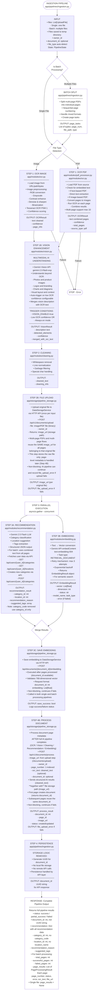

> **For Cursor AI**: This document serves as the **Master Plan and Context** for the `StorageHelperAIOrchestraService`.
> Please read this before generating code to understand the architecture, current progress, and task dependencies.

## 1. Service Overview
**StorageHelperAIOrchestraService** is the "brain" of the Home AI Paper Organizer. It does not handle direct user UI interactions or raw file storage (handled by WebService and DataStorageService respectively).

**Core Responsibilities:**
1.  **Orchestration**: Managing the lifecycle of a document processing request through modular, testable pipelines.
2.  **Ingestion Pipeline**: Image/PDF $\to$ OCR/Text Extraction $\to$ Text Cleaning $\to$ [Parallel: LLM Recommendation + Vector Embedding] $\to$ Persistence.
3.  **Recommendation Engine**: LLM-powered (Gemini 2.5 Flash) intelligent document categorization and storage location suggestion with structured output.
4.  **Multi-Format Support**: Handles both image files (JPG, PNG, etc.) and PDF documents with intelligent processing.

**Note:** Search functionality has been moved to StorageHelperDataStorageService backend for centralized processing.

---

## 2. Architecture & Data Flow

### 2.1 Ingestion Flow

The ingestion pipeline orchestrates the complete document processing workflow from image/PDF upload to storage. Implemented in `app/pipelines/ingestion.py` using a modular, testable architecture with dependency injection.

**Supported File Formats:**
- **Images**: JPG, JPEG, PNG, GIF, BMP, WEBP, TIFF
- **PDFs**: Single or multi-page PDF documents (up to 10 pages processed for performance)

**Input Source (File Binary Upload via Multipart Form Data):**
- **Browser-friendly file upload design**
  - The frontend uploads **raw file binaries** via `multipart/form-data` (similar to `/api/v1/documents/upload` in the DataStorageService).
  - Supports both **single-file** and **multi-file** uploads (`files` parameter is a list of `UploadFile`).
  - **API Endpoint**: `POST /api/v1/ingestion` (AIOrchestraService)
  - **Parameters**:
    - `files`: `List[UploadFile]` – List of files to ingest (required).
    - `owner_id`: `int` – Document owner user ID (required).
    - `document_id`: `Optional[int]` – Existing document ID (optional; if omitted, the first processed page will create one).
    - `file_type`: `Optional[str]` – Optional file type override: `"image"` or `"pdf"` (mainly for single-file uploads; otherwise auto-detected).
  - **Server-side ingestion behavior** (high level):
    1. Save uploaded files to a **temporary directory** for OCR / PDF processing.
    2. For each original file (image or PDF), call the DataStorageService `/api/v1/documents/upload` **exactly once** to store the file and obtain a single `image_url` for that file.
    3. Run the full AI pipeline on a **per-page basis** (OCR → Vision → Cleaning → [Parallel: Recommendation + Embedding]).
    4. For each logical page, call `/api/v1/documents/process` using the shared `image_url` for that file, plus `page_number`, `ocr_text`, and `document_id`.
    5. Clean up temporary files after processing completes.

**Batch Processing Support:**
- **Single File**: Upload one file via `files` parameter: `files=[UploadFile(...)]`.  
  - Single image ⇒ `total_pages = 1`, `page_number = 1`.
  - Single multi-page PDF ⇒ split into N logical pages, `page_number = 1..N` (within that file).
- **Multiple Files**: Upload multiple files: `files=[UploadFile(...), UploadFile(...), ...]`.  
  - Each file is treated independently for page numbering: each file has its own `page_number = 1..N_file`.
  - Each file is uploaded **once** and has a single `image_url` that is reused across all of its pages.
- **Multi-page PDFs**: Automatically split into logical pages for AI processing (per-file page numbering).
- **Mixed Formats**: Supports combinations of images and PDFs in a single batch.
- **Document ID Management**: The first successfully processed page establishes `document_id` (via `/documents/process`); all subsequent pages (across all files in the batch) reuse the same `document_id`.

#### Pipeline Architecture


```mermaid
flowchart TD
    Start([INGESTION PIPELINE<br/>app/pipelines/ingestion.py]) --> Input["INPUT<br/>• files: List[UploadFile]<br/>  - Single: one file<br/>  - Batch: multiple files<br/>• Files saved to temp directory<br/>• owner_id<br/>• document_id: optional<br/>• file_type auto-detect<br/>State: PipelineState"]
    
    Input --> BatchCheck{"Is Batch<br/>Processing?"}
    
    BatchCheck -->|Single File| FileType{"File Type<br/>Detection"}
    BatchCheck -->|Multiple Files| BatchSplit["BATCH SPLIT<br/>app/pipelines/ingestion.py<br/>─────────────────<br/>• Split multi-page PDFs<br/>  into individual pages<br/>• Sequential page numbering<br/>• Handle mixed formats<br/>• Create page tasks<br/>─────────────────<br/>OUTPUT: page_tasks<br/>  List of tuples: page_num, file_path, type"]
    
    BatchSplit --> FileType
    
    FileType -->|Image| OCR["STEP 1: OCR IMAGE<br/>app/modules/ocr.py<br/>─────────────────<br/>• Load image from URL/path/bytes<br/>• Image preprocessing:<br/>  - RGB conversion<br/>  - Grayscale<br/>  - Contrast enhance<br/>  - Denoise & sharpen<br/>  - Binarization<br/>• Tesseract OCR PSM 1<br/>• Confidence scoring<br/>─────────────────<br/>OUTPUT: OCRResult<br/>  - text cleaned<br/>  - confidence<br/>  - page_info"]
    
    FileType -->|PDF| PDFOCR["STEP 1: OCR PDF<br/>app/modules/pdf_processor.py<br/>app/modules/ocr.py<br/>─────────────────<br/>• Load PDF from source<br/>• Check for embedded text<br/>• If text-based PDF:<br/>  - Direct text extraction<br/>• If image-based PDF:<br/>  - Convert pages to images<br/>  - Run OCR on each page<br/>  - Combine results<br/>• Multi-page support max 10<br/>─────────────────<br/>OUTPUT: OCRResult<br/>  - text combined pages<br/>  - confidence<br/>  - total_pages<br/>  - source_type: pdf"]
    
    PDFOCR --> Vision
    OCR --> Vision["STEP 1B: VISION ENHANCEMENT<br/>app/modules/vision.py<br/>─────────────────<br/>MULTIMODAL AI UNDERSTANDING<br/>─────────────────<br/>• Gemini Vision API<br/>  gemini-2.0-flash-exp<br/>• Understands beyond OCR:<br/>  - Photos and product images<br/>  - Logos and branding<br/>  - Charts and diagrams<br/>  - Visual layout and context<br/>• Auto-trigger on low OCR<br/>  confidence configurable<br/>• Merges vision description<br/>  with OCR text<br/>─────────────────<br/>TRIGGER CONDITIONS:<br/>  - VISION_ENABLE=true<br/>  - Low OCR confidence OR<br/>  - Always-on mode<br/>─────────────────<br/>OUTPUT: VisionResult<br/>  - description text<br/>  - detected_elements<br/>  - confidence<br/>  - merged_with_ocr_text"]
    
    Vision --> Cleaning["STEP 2: CLEANING<br/>app/modules/cleaning.py<br/>─────────────────<br/>• Whitespace removal<br/>• Line normalization<br/>• Garbage filtering<br/>• Special char handling<br/>─────────────────<br/>OUTPUT:<br/>  - cleaned_text<br/>  - cleaning_info"]
    
    Cleaning --> Upload["STEP 2B: FILE UPLOAD<br/>app/storage/pipeline_storage.py<br/>─────────────────<br/>• Upload original file to DataStorageService<br/>  via HTTP API (once per input file)<br/>• POST /api/v1/documents/upload<br/>  - file: image/PDF file (binary)<br/>  - owner_id<br/>  - Returns: image_url (storage path)<br/>• Multi-page PDFs and multi-page flows<br/>  reuse the SAME image_url for all pages<br/>  belonging to that original file<br/>• This step stores the raw file only; page-<br/>  level metadata is handled later (Step 4B)<br/>• Non-blocking: AI pipeline can continue<br/>  and record file_upload_error if upload fails<br/>─────────────────<br/>OUTPUT: image_url (per original file)<br/>OUTPUT: file_upload_error if fails"]
    
    OCR -->|Failure| Stop1([STOP - Error])
    PDFOCR -->|Failure| Stop1
    
    style FileType fill:#0000
    style BatchCheck fill:#0000
    style BatchSplit fill:#0000
    
    Upload --> Parallel["STEP 3: PARALLEL EXECUTION<br/>asyncio.gather - concurrent"]
    
    Parallel --> Recommendation["STEP 3A: RECOMMENDATION<br/>app/modules/recommendation.py<br/>─────────────────<br/>• Gemini 2.5 Flash LLM<br/>• Category classification<br/>• Location suggestion<br/>• Tags extraction<br/>• Structured JSON output<br/>• For batch: uses combined<br/>  text from all pages<br/>• Fetches user data via API:<br/>  - GET /api/users/{user_id}/categories<br/>  - GET /api/users/{user_id}/locations<br/>• Creates new categories via API:<br/>  - POST /api/users/{user_id}/categories<br/>─────────────────<br/>OUTPUT: recommendation_result<br/>  - category_id: int<br/>  - location_id: int<br/>  - recommendation_reason<br/>  - suggested_tags: array<br/>  - Note: category_code removed<br/>    use category_id only"]
    
    Parallel --> Embedding["STEP 3B: EMBEDDING<br/>app/modules/embedding.py<br/>─────────────────<br/>• Text → Vector conversion<br/>• Gemini API embedContent<br/>  text-embedding-004<br/>• Task type: RETRIEVAL_DOCUMENT<br/>• Retry mechanism: max 3 attempts<br/>• Exponential backoff<br/>• Returns EmbeddingResult object<br/>• For semantic search<br/>─────────────────<br/>OUTPUT: EmbeddingResult<br/>  - vector: List[float]<br/>  - dimension: int<br/>  - status: str<br/>  - model_name, task_type<br/>  - error (if failed)"]
    
    Recommendation --> Merge{Merge Results}
    Embedding --> Merge
    
    Merge --> SaveEmbedding["STEP 3C: SAVE EMBEDDING<br/>app/storage/pipeline_storage.py<br/>─────────────────<br/>• Save embedding to DataStorageService<br/>  via HTTP API<br/>• POST /api/documents/{document_id}/embedding<br/>• Executed after pages processed<br/>  (document_id available)<br/>• Validates 768-dimensional vector<br/>• Request format:<br/>  document_id: int<br/>  embedding: List[float]<br/>• Non-blocking, continues if fails<br/>• Called in both single and batch<br/>  processing pipelines<br/>─────────────────<br/>OUTPUT: save_success: bool<br/>Logs success/failure status"]
    
    SaveEmbedding --> ProcessDoc["STEP 4B: PROCESS DOCUMENT<br/>app/storage/pipeline_storage.py<br/>─────────────────<br/>• Process document page metadata<br/>  AFTER full AI pipeline completes<br/>  (OCR / Vision / Cleaning / Recommendation / Embedding)<br/>• POST /api/v1/documents/process<br/>  - image_url: from upload step (/documents/upload)<br/>  - owner_id<br/>  - page_number: 1-indexed<br/>  - ocr_text: cleaned_text (optional)<br/>  - document_id: optional<br/>• Sends structured AI results (cleaned_text)<br/>  **together with** file storage path (image_url)<br/>• First page creates document (returns document_id)<br/>• Subsequent pages reuse the same document_id<br/>• Non-blocking, continues if fails<br/>─────────────────<br/>OUTPUT: process_result<br/>  - document_id: int<br/>  - page_id<br/>  - image_url<br/>  - status: created/updated<br/>OUTPUT: file_upload_error if fails"]
    
    ProcessDoc --> Persistence["STEP 4: PERSISTENCE<br/>app/pipelines/ingestion.py<br/>─────────────────<br/>STORAGE LOGIC REMOVED:<br/>• Generate UUID for document_id<br/>• No local file storage<br/>• No remote API calls<br/>• Persistence handled by API layer<br/>─────────────────<br/>OUTPUT: document_id UUID string<br/>for API response"]
    
    Persistence --> Response["RESPONSE: Complete Pipeline Output<br/>─────────────────<br/>Returns full pipeline results<br/>• status: success / partial_success / failed<br/>• document_id: int, not UUID string<br/>• recommendation: Dict with all recommendation data<br/>  - category_id: int, no category_code<br/>  - location_id: int, no location_name<br/>  - recommendation_reason<br/>  - suggested_tags<br/>• For batch processing:<br/>  - total_pages: int<br/>  - successful_pages: int<br/>  - failed_pages: int<br/>  - page_results: List of PageProcessingResult<br/>    Each page: page_number, status,<br/>    error, ocr_text, file_url<br/>• Single file: page_results = None"]
    
    style Start fill:#0000
    style Stop1 fill:#0000
    style Response fill:#0000
    style Parallel fill:#0000
    style Merge fill:#0000
```

#### Key Design Features

1. **Modular Architecture**: Each step is a separate method, making the pipeline highly testable and maintainable
2. **Dependency Injection**: All modules (OCR, vision, cleaning, recommendation, embedding, storage) are injected via constructor
3. **State Management**: `PipelineState` dataclass tracks all processing results and metadata throughout the pipeline
4. **Multimodal Intelligence**: Vision Enhancement (Step 1B) adds semantic understanding beyond OCR text extraction
5. **Batch Processing**: 
   - **Unified API**: Single `/ingestion` endpoint handles both single and batch uploads
   - **PDF Splitting**: Multi-page PDFs automatically split into individual pages with sequential numbering
   - **Document ID Management**: First page processed synchronously to establish `document_id`, remaining pages processed in parallel using the same ID
   - **Mixed Formats**: Supports combinations of images and PDFs in a single batch
   - **Page-level Results**: Each page tracked individually with status, OCR text, and error information
   - **Combined Recommendation**: All page texts combined for single recommendation and embedding generation
6. **Parallel Processing**: 
   - Steps 3A (Recommendation) and 3B (Embedding) run concurrently using `asyncio.gather()`
   - Batch processing: First page synchronous, remaining pages processed in parallel
6. **Error Resilience**: 
   - Cleaning failure doesn't stop pipeline (falls back to raw OCR text)
   - Vision enhancement failure doesn't stop pipeline (graceful degradation to OCR-only)
   - Recommendation and embedding failures are logged independently
   - File upload failure doesn't stop pipeline (AI processing continues, error tracked)
   - Pipeline continues to completion to retain partial results
   - Upload task properly cancelled if OCR fails to prevent resource leaks
7. **Storage Architecture**: 
   - **Local file storage removed**: No longer saves to `tmp/documents/`, `tmp/embeddings/`, `tmp/images/`, `tmp/pdfs/`, or `index.json`.
   - **🆕 API-based category and location management**: Categories and locations are now fetched and saved via API instead of local JSON files.
     - **Categories**: `GET /api/users/{user_id}/categories` (fetch), `POST /api/users/{user_id}/categories` (create)
     - **Locations**: `GET /api/users/{user_id}/locations` (fetch)
     - **User isolation**: Each user has independent categories and locations stored in the database.
     - **No local files**: Removed `tmp/Storage/document_categories.json` and `tmp/Storage/locations.json` dependencies.
   - **File upload integration (two-step, API-based)**:
     - **Step 1 – Upload Original File (per input file)**  
       - API: `POST /api/v1/documents/upload` (DataStorageService, public API)
       - Parameters:
         - `file`: Original image/PDF file (binary, from `multipart/form-data`)
         - `owner_id`: Document owner user ID
       - Behavior:
         - Each input file is uploaded **once**, regardless of how many logical pages it contains.
         - The API returns a single `image_url` and `filename` for that file.
         - All logical pages derived from that file (e.g. split PDF pages) **reuse the same `image_url`**.
       - Purpose: Persist the raw file and obtain a stable storage path to be referenced by all downstream page records.
     - **Step 2 – Process Document Page (per logical page)**  
       - API: `POST /api/v1/documents/process` (DataStorageService, public API)
       - Parameters:
         - `image_url`: From the upload step (shared by all pages of that file)
         - `owner_id`: Document owner user ID
         - `page_number`: Page index **within that file** (1-indexed, 1..N_file)
         - `ocr_text`: Optional cleaned OCR text for this page
         - `document_id`: Optional existing document ID; when omitted, the first page creates a new document
       - Returns: `document_id`, `page_id`, `image_url`, `status` (created/updated), `page_number`
       - Purpose: Persist per-page metadata while linking each page back to the shared file URL.
     - **Document ID Management**:
       - The first successfully processed page (where `document_id` is absent) creates a new `document_id`.
       - All subsequent pages in the ingestion batch (including pages from other files in the same request) reuse this `document_id`, ensuring a single logical document in the database.
   - **API-only persistence**: Storage logic is removed from the pipeline; all persistence is handled through DataStorageService HTTP APIs.
   - **Unified output management**: `PipelineStorage` provides methods to format and return complete pipeline results.
   - **Output schema**: `DocumentOutputSchema` manages the output structure and field inclusion.
   - **File upload error tracking**: Upload failures are tracked per file/page without blocking AI processing; errors are exposed via a `file_upload_error` field in the output.
   - **🆕 Embedding persistence**: Embeddings are automatically saved to DataStorageService after generation
     - **API Endpoint**: `POST /api/documents/{document_id}/embedding`
     - **Timing**: Executed after pages processed (document_id available) and embedding generation succeeds
     - **Format**: `{"document_id": int, "embedding": List[float]}` (768 dimensions)
     - **Validation**: Ensures 768-dimensional vector before saving
     - **Error handling**: Save failures logged but don't stop pipeline execution
     - **Integration**: Called automatically in both single-file and batch processing pipelines
8. **Response Format**:
   - **Unified Structure**: Single response format for both single and batch processing
   - **Document ID**: Integer type (not UUID string) for consistency with database
   - **Recommendation Field**: All recommendation data in single `recommendation` Dict
     - Uses `category_id` (int) instead of `category_code` (string) to save space
     - Uses `location_id` (int) instead of `location_name` (string)
     - Removed redundant fields: `detected_type_code`, `recommended_location_id`, `recommended_location_reason`
   - **Batch Fields**: `total_pages`, `successful_pages`, `failed_pages`, `page_results` (only present for batch)
8. **Comprehensive Logging**: Each step logs progress, timing, and results for debugging and monitoring

#### Module Details

| Module | Location | Responsibility |
|--------|----------|----------------|
| **OCR Module** | `app/modules/ocr.py` | Image/PDF preprocessing, file type detection, Tesseract OCR, confidence scoring |
| **PDF Processor** | `app/modules/pdf_processor.py` | PDF loading, text extraction, PDF-to-image conversion, multi-page handling |
| **Vision Module** | `app/modules/vision.py` | 🆕 Multimodal understanding using Gemini Vision API - sees photos, logos, charts beyond OCR |
| **Cleaning Module** | `app/modules/cleaning.py` | Text normalization, noise removal, quality filtering |
| **Recommendation Module** | `app/modules/recommendation.py` | LLM-based category and location suggestion using Gemini API. Fetches user categories and locations via API (`GET /api/users/{user_id}/categories`, `GET /api/users/{user_id}/locations`). Creates new categories via API (`POST /api/users/{user_id}/categories`) when needed. |
| **Embedding Module** | `app/modules/embedding.py` | Vector generation using Gemini API embedContent (text-embedding-004) with retry mechanism |
| **Pipeline Storage** | `app/storage/pipeline_storage.py` | Unified storage handler for all pipeline output results (API-based, no local files). Handles file uploads to DataStorageService via HTTP API. |
| **Output Schema** | `app/storage/output_schema.py` | Unified management of pipeline output structure and fields |

#### Vision Module Implementation Details

**🆕 NEW: Multimodal Vision Understanding**

The `VisionAnalyzer` class (`app/modules/vision.py`) is a breakthrough enhancement that addresses OCR's fundamental limitation: **traditional OCR can only "read text" but cannot "see images"**.

**Problem Statement:**
Traditional OCR (Tesseract) fails to understand:
- Product photos on warranty cards
- Company logos on invoices
- Charts and diagrams in reports
- Handwritten sketches or markings
- Complex layouts with mixed text and visuals

**Solution:**
Gemini Vision API (multimodal) can understand images holistically - both text AND visual content.

**API Configuration:**
- **Endpoint**: Gemini API `generateContent` endpoint
- **Model**: `gemini-2.0-flash-exp` (Google's latest multimodal model)
- **Capabilities**: 
  - Reads text with comparable accuracy to OCR
  - Describes photos, logos, charts, diagrams
  - Understands layout and visual context
  - Extracts semantic meaning from images

**Integration Strategy:**
1. **Smart Triggering**: Vision enhancement is optional and configurable
   - Auto-trigger when OCR confidence is low (< 0.6 by default)
   - OR always-on mode for maximum understanding
   - OR completely disabled for cost optimization
2. **Graceful Enhancement**: Vision runs AFTER OCR, enhancing (not replacing) it
   - OCR provides precise text extraction
   - Vision adds semantic understanding and visual context
   - Results are merged: `OCR Text + Vision Description`
3. **Error Resilience**: Vision failure doesn't stop the pipeline
   - Graceful degradation to OCR-only if Vision API fails
   - Cost-optimized: only runs when needed

**Configuration Options** (in `app/core/config.py`):
```python
VISION_ENABLE = True  # Master switch
VISION_AUTO_TRIGGER_ON_LOW_OCR = True  # Smart triggering
VISION_OCR_CONFIDENCE_THRESHOLD = 0.6  # Trigger threshold
VISION_MODEL = "gemini-2.0-flash-exp"
```

**Example Use Cases:**
- **Warranty Card with Product Photo**: OCR extracts warranty details, Vision identifies "Dyson V11 vacuum cleaner" from product image
- **Insurance Document with Logo**: OCR extracts policy text, Vision recognizes "Blue Cross Blue Shield logo"
- **Receipt with Faded Text**: OCR struggles (low confidence), Vision auto-triggers and recovers full content
- **Chart-Heavy Report**: OCR extracts titles, Vision describes "bar chart showing quarterly revenue growth"

#### Embedding Module Implementation Details

The `EmbeddingGenerator` class (`app/modules/embedding.py`) is a critical component for generating document embeddings:

**API Configuration:**
- **Endpoint**: Gemini API `embedContent` endpoint
- **Model**: `text-embedding-004` (Google's production embedding model)
- **Task Type**: 
  - `RETRIEVAL_DOCUMENT` for document ingestion
  - Embeddings are saved to DataStorageService for future search use

**🆕 EmbeddingResult Class:**
- **Encapsulation**: Embedding output is now encapsulated in `EmbeddingResult` dataclass
  - `vector`: List[float] - The embedding vector
  - `dimension`: int - Vector dimension
  - `status`: str - "success", "failed", or "pending"
  - `model_name`: Optional[str] - Model used for generation
  - `task_type`: Optional[str] - Task type used
  - `error`: Optional[str] - Error message if generation failed
  - `raw_response`: Optional[Dict] - Full API response
- **Benefits**:
  - Better type safety and encapsulation
  - Consistent with `OCRResult` and `VisionResult` design patterns
  - Easier to extend with additional metadata
  - Structured error handling
- **Helper Methods**:
  - `is_successful`: Property to check if embedding generation was successful
  - `to_dict()`: Convert to dictionary for serialization
  - `create_failed()`: Class method to create failed result
  - `create_pending()`: Class method to create pending result

**Key Features:**
1. **Retry Mechanism**: Implements exponential backoff with configurable max retries (default: 3)
   - Initial delay: 1 second
   - Exponential backoff: delay doubles after each failure
   - Returns `EmbeddingResult` with failed status instead of raising exception
2. **Error Handling**: 
   - HTTP errors are caught and retried
   - Invalid responses trigger retries
   - Empty/whitespace text returns `EmbeddingResult.create_failed()`
   - All failures return structured `EmbeddingResult` instead of raising exceptions
3. **Batch Processing**: `generate_batch()` method returns `List[EmbeddingResult]`
4. **Configurability**: 
   - Custom model name
   - API key injection
   - Task type selection
   - Timeout settings (default: 30s)

**Performance Considerations:**
- Asynchronous implementation using `httpx.AsyncClient`
- Timeout protection prevents hanging requests
- Graceful degradation on failures (returns failed `EmbeddingResult` instead of raising exception)

**🆕 Embedding Persistence:**
- **Automatic Saving**: After embedding generation, embeddings are automatically saved to DataStorageService
- **API Endpoint**: `POST /api/documents/{document_id}/embedding`
- **Timing**: Executed after pages are processed (document_id available) and embedding generation succeeds
- **Format**: 
  ```json
  {
    "document_id": 123,
    "embedding": [0.123, -0.456, 0.789, ...]  // 768 dimensions
  }
  ```
- **Validation**: 
  - Ensures embedding vector is exactly 768 dimensions
  - Validates document_id is available and valid
- **Error Handling**: 
  - Save failures are logged but don't stop pipeline execution
  - Comprehensive error handling for connection, HTTP, and timeout errors
- **Integration**: 
  - Implemented in `PipelineStorage.save_document_embedding()` method
  - Called automatically in both single-file and batch processing pipelines
  - Non-blocking: Pipeline continues even if embedding save fails

**Integration Pattern:**
```python
# Default instance for backward compatibility
generator = EmbeddingGenerator(
    model_name="text-embedding-004",
    api_key="",  # Configured via environment
    task_type="RETRIEVAL_DOCUMENT"
)
embedding_result = await generator.generate(text)

# Check if successful
if embedding_result.is_successful:
    vector = embedding_result.vector
    dimension = embedding_result.dimension
else:
    error = embedding_result.error
```

#### PDF Processing Details

The `pdf_processor` module (`app/modules/pdf_processor.py`) handles PDF document processing:

**Key Features:**
1. **Intelligent Processing**: Automatically detects if PDF has embedded text or is image-based
2. **Text Extraction**: For text-based PDFs, directly extracts text without OCR (faster, 100% accuracy)
3. **Image Conversion**: For image-based PDFs, converts pages to high-resolution images for OCR
4. **Multi-Page Support**: Processes up to 10 pages (configurable) to balance accuracy and performance
5. **PyMuPDF Integration**: Uses PyMuPDF (fitz) library for robust PDF handling

**Processing Methods:**
- **Text-based PDF**: Direct text extraction via `extract_text_from_pdf()`
- **Image-based PDF**: Page-by-page OCR via `convert_pdf_to_images()` + Tesseract OCR
- **Hybrid Approach**: Automatically selects best method via `process_pdf_for_ocr()`

**Performance Considerations:**
- DPI: 300 (configurable) for image rendering
- Max pages: 10 (default) to prevent long processing times
- Async implementation for non-blocking operations

#### Error Handling Strategy

- **OCR Failure**: Pipeline stops immediately, returns error status
- **PDF Processing Failure**: Pipeline stops, returns error status
- **File Upload Failure (Step 2B)**: Continue with AI processing, set `file_upload_error` field, log warning. Process step will be skipped if no `image_url` available.
- **Document Processing Failure (Step 4B)**: Continue pipeline, set `file_upload_error` field, log warning. AI processing results are still available.
- **Vision Enhancement Failure**: 🆕 Continue with OCR text only (graceful degradation), log warning
- **Cleaning Failure**: Continue with raw OCR text, log warning
- **Recommendation Failure**: Log error, continue to completion with partial data
- **Embedding Failure**: Log error, continue to completion
- **Persistence Step**: Only generates UUID for document_id; actual persistence handled by API layer

### 2.2 Search Functionality (Future Implementation)

**🔄 Architecture Change:** Search functionality has been moved to `StorageHelperDataStorageService` backend for centralized processing and better performance.

**Future Search Flow:**
```
User Query (Text) 
    ↓
AIOrchestraService: Generate Query Embedding
    ↓
POST /api/documents/search (to DataStorageService)
    Request: {
      "query_embedding": [0.23, -0.45, 0.67, ...],  // 768-dim vector
      "owner_id": 1,
      "top_k": 10
    }
    ↓
DataStorageService: Vector Similarity Search
    - Load document embeddings from database
    - Calculate cosine similarity
    - Rank and filter results
    ↓
Response: {
      "results": [
        {
          "document_id": 123,
          "score": 0.89,
          "title": "...",
          "snippet": "...",
          "location_id": 2,
          ...
        }
      ]
    }
```

**Implementation Location:**
- **Query Embedding Generation**: `StorageHelperAIOrchestraService` (using existing `EmbeddingGenerator` with `RETRIEVAL_QUERY` task type)
- **Search API Endpoint**: `StorageHelperDataStorageService` - should implement `POST /api/documents/search` endpoint
- **Vector Similarity Search**: `StorageHelperDataStorageService` - should use MySQL VECTOR type for efficient similarity search
- **Result Assembly**: `StorageHelperDataStorageService` - should join with document and location tables to return complete results

**Integration Points:**
1. **AIOrchestraService** will generate query embeddings using `EmbeddingGenerator.generate()` with `task_type="RETRIEVAL_QUERY"`
2. **AIOrchestraService** will call `POST /api/documents/search` on DataStorageService with the query embedding vector
3. **DataStorageService** will handle all search logic including:
   - Vector similarity calculation (using MySQL VECTOR functions)
   - Document metadata retrieval
   - Location information joining
   - Result ranking and filtering

**Benefits:**
- Centralized search processing in data layer
- Direct database access for better performance
- Simplified architecture (search logic in one place)
- Embeddings already stored in DataStorageService database

---

## 3. Implementation Plan & Progress Tracking

**Current Phase:** Phase 2 (AI Backend Implementation) - Near Completion
**Timeline:** Dec 11 – Dec 24
**Last Updated:** Dec 6, 2025

### 3.1 Setup & Infrastructure
- [x] **BE-01**: Initialize Python Project (FastAPI/Flask) & Env Setup
  - ✅ FastAPI application initialized in `main.py`
  - ✅ Configuration management implemented in `app/core/config.py`
  - ✅ Dependencies defined in `requirements.txt`
- [x] **BE-05**: Create Orchestration Controller (Entry points: `ingest`, `search`, `recommend`)
  - ✅ API router implemented in `app/api/router.py`
  - ✅ All three endpoints functional: `/ingestion`, `/search`, `/feedback`
  - ✅ Request/response schemas defined in `app/api/schemas.py`
- [x] **INF-01**: Setup basic logging (OCR errors, pipeline tracking)
  - ✅ Logging integrated across all modules
  - ✅ Pipeline step tracking implemented in ingestion and search pipelines

### 3.2 Ingestion Pipeline (Target: Dec 11–17)
- [x] **AI-01**: Select OCR Engine (Tesseract or Cloud API) & Test scripts
  - ✅ Tesseract OCR selected for MVP (cost-effective)
  - ✅ Tesseract binaries included in `app/modules/tesseract/`
  - ✅ Configurable via environment variables
- [x] **AI-02**: Implement `OCR Module`: `run_ocr(image_path) -> raw_text`
  - ✅ Full implementation in `app/modules/ocr.py`
  - ✅ Supports URL, local file path, and byte stream inputs
  - ✅ Image preprocessing pipeline (grayscale, contrast, denoising, binarization)
  - ✅ Confidence scoring and detailed OCR results
- [x] **AI-03**: Implement `Text Cleaning Module`: Noise removal, lowercase, truncation
  - ✅ Implementation in `app/modules/cleaning.py`
  - ✅ Whitespace normalization, garbage character removal
  - ✅ Low-confidence text filtering support
- [x] **AI-04**: Implement `Metadata Extractor`: Simple rules for Title, Date, Keywords
  - ✅ Integrated within recommendation module
  - ✅ Gemini LLM-based extraction of tags and category
- [x] **AI-05**: **Pipeline Integration**: Connect DB $\to$ OCR $\to$ Clean $\to$ Update DB
  - ✅ Complete pipeline orchestration in `app/pipelines/ingestion.py`
  - ✅ Modular step-by-step processing with state management
  - ✅ Local storage integration for document persistence
  - ✅ Embedding generation and storage support

### 3.3 Recommendation (Target: Dec 18–24)
- [x] **AI-09**: Implement `Location Recommendation`: Rule-based logic (Keyword $\to$ LocationID)
  - ✅ Advanced LLM-based recommendation in `app/modules/recommendation.py`
  - ✅ Uses Gemini 2.5 Flash for intelligent category and location suggestions
  - ✅ Structured output with category codes, location IDs, and reasoning
  - ✅ Support for new category creation
  - ✅ **🆕 API-based data management**: Categories and locations fetched/saved via API (`/api/users/{user_id}/categories`, `/api/users/{user_id}/locations`) instead of local JSON files
- [ ] **AI-11**: Implement `Feedback Handler`: API to record user feedback signals
  - ⚠️ API endpoint exists but handler not fully implemented
  - ⚠️ Current implementation in `app/pipelines/feedback.py` raises NotImplementedError

### 3.4 QA & Testing
- [ ] **QA-01**: Unit Tests for OCR Wrapper & Text Cleaner
  - ⚠️ No test files found in codebase
- [ ] **QA-02**: Integration Test Script (End-to-End: Upload to Search)
  - ⚠️ No integration tests found in codebase

### Summary
**Completion Status: 12/14 tasks completed (86%)**
- **Completed:** Core ingestion pipeline and recommendation system
- **Remaining:** Feedback handler implementation and comprehensive testing suite
- **Note:** Search functionality moved to StorageHelperDataStorageService backend

---

## 4. API Interface Contracts (Internal Draft)

### Endpoints

#### POST `/api/v1/ingestion`
**Unified ingestion endpoint for single and batch processing**

**🆕 API Design (File Binary Upload via Multipart Form Data):**
The frontend uploads raw file binaries via `multipart/form-data`, which avoids any need for the browser to know local absolute paths.

**Request (multipart/form-data):**
```
POST /api/v1/ingestion
Content-Type: multipart/form-data

files: [UploadFile, ...]   // List of files to ingest (required; supports single or multiple files)
owner_id: int              // Document owner user ID (required)
document_id: int (optional) // Existing document ID, if appending pages to an existing document
file_type: str (optional)   // Optional override: "image" or "pdf" (primarily for single-file uploads)
```

**Example (cURL):**
```bash
curl -X POST http://localhost:8001/api/v1/ingestion \
  -F "files=@/path/to/file1.pdf" \
  -F "files=@/path/to/file2.jpg" \
  -F "owner_id=1" \
  -F "document_id=123"  # optional
```

**Example (JavaScript/Fetch):**
```javascript
const formData = new FormData();
formData.append('files', fileInput.files[0]);       // Single file
// For multiple files:
// for (const f of fileInput.files) formData.append('files', f);
formData.append('owner_id', '1');
// formData.append('document_id', '123');  // optional

fetch('http://localhost:8001/api/v1/ingestion', {
  method: 'POST',
  body: formData
});
```

**Response (Single File, Single Page):**
```json
{
  "status": "success",
  "document_id": 13,
  "recommendation": {
    "category_id": 4,
    "location_id": 1,
    "recommendation_reason": "This document is a professional resume...",
    "suggested_tags": ["Resume", "CV", "Work Experience", "Software Developer", "Education"]
  },
  "total_pages": 1,
  "successful_pages": 1,
  "failed_pages": 0,
  "page_results": [
    {
      "page_number": 1,
      "status": "success",
      "error": null,
      "ocr_text": "Extracted text...",
      "file_url": "./tmp\\\\documents/1/pages/xxxx.pdf",
      "document_id": 13,
      "page_id": 62
    }
  ]
}
```

**Response (Batch Processing – Multiple Files and/or Multi-page PDFs):**
```json
{
  "status": "success",
  "document_id": 42,
  "recommendation": {
    "category_id": 3,
    "location_id": 1,
    "recommendation_reason": "Combined analysis of all pages...",
    "suggested_tags": ["tag1", "tag2"]
  },
  "total_pages": 5,
  "successful_pages": 5,
  "failed_pages": 0,
  "page_results": [
    {
      "page_number": 1,
      "status": "success",
      "error": null,
      "ocr_text": "Extracted text (file A, page 1)...",
      "file_url": "./tmp\\\\documents/1/pages/fileA.pdf",
      "document_id": 42,
      "page_id": 101
    },
    {
      "page_number": 2,
      "status": "success",
      "error": null,
      "ocr_text": "Extracted text (file A, page 2)...",
      "file_url": "./tmp\\\\documents/1/pages/fileA.pdf",
      "document_id": 42,
      "page_id": 102
    }
    // ... additional pages from other files, each with its own page_number
  ]
}
```

**Key Features:**
- **Unified API**: Single endpoint handles both single-file and batch ingestion via `multipart/form-data` (`files` list).
- **Per-file upload**: Each original file is uploaded once; all its pages reuse the same `image_url`.
- **PDF Splitting**: Multi-page PDFs are split into logical pages for AI processing, with page numbers defined **within each file** (1..N_file).
- **Document ID**: Integer type; the first successfully processed page establishes the `document_id`, and all subsequent pages reuse it.
- **Recommendation**: All recommendation data is returned in a single `recommendation` field.
  - Uses IDs (`category_id`, `location_id`) instead of codes/names to save space.
  - Removes redundant fields for a cleaner response.

---

## 5. File Structure
*(Please update this tree as we create files to keep context fresh)*

```text
StorageHelperAIOrchestraService/
├── app/
│   ├── api/                    # REST API layer
│   │   ├── __init__.py
│   │   ├── router.py           # API route definitions
│   │   └── schemas.py          # Pydantic request/response models
│   ├── core/                   # Core configurations
│   │   ├── __init__.py
│   │   ├── category_config.py  # Document category definitions
│   │   └── config.py           # Service configuration
│   ├── modules/                # Business logic modules
│   │   ├── __init__.py
│   │   ├── cleaning.py         # Text cleaning & normalization
│   │   ├── embedding.py        # Vector embedding generation
│   │   ├── ocr.py              # OCR engine wrapper (image + PDF)
│   │   ├── pdf_processor.py    # PDF processing & conversion
│   │   ├── recommendation.py   # Location recommendation logic
│   │   ├── vision.py           # 🆕 Vision AI for multimodal understanding
│   │   └── tesseract/          # Tesseract OCR binaries & data
│   ├── pipelines/              # Orchestration workflows
│   │   ├── __init__.py
│   │   ├── feedback.py         # User feedback processing
│   │   └── ingestion.py        # Document ingestion pipeline
│   └── storage/                # Pipeline output storage management
│       ├── __init__.py
│       ├── pipeline_storage.py # Unified storage handler for pipeline results (API-based)
│       └── output_schema.py    # Unified output structure management
├── tmp/                        # Runtime temporary storage (deprecated)
│   └── README.md               # Note: Categories and locations now managed via API
├── main.py                     # FastAPI application entry point
├── requirements.txt            # Python dependencies
└── README.md                   # Service documentation
```

---

## 6. Development Log / Notes
*   **Project Initialization**: FastAPI-based service architecture established with modular pipeline design
*   **OCR Engine Selection**: Chose Tesseract OCR for MVP to minimize costs and enable offline processing
    - Bundled Tesseract binaries with application for easy deployment
    - Implemented comprehensive image preprocessing for better accuracy
    - PSM mode 1 (auto with OSD) for handling rotated/oriented documents
*   **Recommendation System**: Upgraded from rule-based to LLM-powered recommendations
    - Integrated Gemini 2.5 Flash API for intelligent document categorization
    - Structured output schema ensures consistent recommendation format
    - Support for dynamic category creation when existing categories don't match
*   **Embedding System**: Vector generation using Gemini API for semantic search
    - Integrated Gemini API text-embedding-004 model (production-grade)
    - Configurable task types: RETRIEVAL_DOCUMENT for ingestion, RETRIEVAL_QUERY for search
    - Robust retry mechanism with exponential backoff (max 3 attempts, 30s timeout)
    - Batch processing support for multiple documents
    - Asynchronous implementation for non-blocking operations
    - **🆕 EmbeddingResult Class** (December 8, 2025):
      - Encapsulated embedding output in `EmbeddingResult` dataclass for better type safety
      - Consistent with `OCRResult` and `VisionResult` design patterns
      - Includes vector, dimension, status, model_name, task_type, and error information
      - Helper methods: `is_successful`, `to_dict()`, `create_failed()`, `create_pending()`
      - Updated `PipelineState` to use `embedding_result: Optional[EmbeddingResult]` instead of separate `embedding` and `embedding_status` fields
      - All embedding generation methods now return `EmbeddingResult` instead of `List[float]`
      - Temporary debug function `save_embedding_result_to_local()` for debugging (saves to `tmp/embeddings/`)
*   **Pipeline Architecture**: Implemented modular, testable pipeline design
    - Dependency injection for all modules (OCR, cleaning, embedding, storage)
    - State management pattern for tracking processing steps
    - Comprehensive error handling and logging throughout
*   **Storage Architecture Refactoring** (December 5, 2025):
    - **Removed Local File Storage**: Eliminated all local file operations (tmp/documents/, tmp/embeddings/, tmp/images/, tmp/pdfs/, index.json)
    - **Unified Pipeline Storage**: Created `PipelineStorage` class to handle all pipeline output results via API
    - **Output Schema Management**: Added `DocumentOutputSchema` class for unified output structure management
    - **API Integration**: All storage operations now handled via remote API (DataStorageService)
    - **Simplified Pipeline**: Ingestion pipeline no longer handles persistence; only generates UUID for document_id
    - **Complete API Response**: `/api/v1/ingestion` now returns full pipeline output via `PipelineStorage.get_pipeline_output()`
    - **Removed Integrations Folder**: Consolidated `storage_client.py` functionality into `pipeline_storage.py`
    - **Backward Compatibility**: Maintained convenience functions and class interfaces for smooth transition
*   **PDF Support Implementation** (December 3, 2025):
    - Added comprehensive PDF processing capability to handle both image and text-based PDFs
    - Created `pdf_processor.py` module with PyMuPDF integration
    - Extended OCR module with automatic file type detection (image vs PDF)
    - Intelligent processing: direct text extraction for text-based PDFs, OCR for image-based
    - Multi-page support (up to 10 pages) with page-by-page processing
    - Updated storage module to handle both image and PDF files
    - Enhanced API schemas to support `file_type` parameter
    - Modified ingestion pipeline to auto-detect and route files appropriately
    - Search functionality fully compatible with PDF documents
    - Backward compatible: existing image processing unchanged
*   **Vision Enhancement Implementation** (December 4, 2025):
    - **Major Feature**: Added multimodal vision understanding to address OCR's fundamental limitation
    - **Problem Identified**: Traditional OCR can only "read text" but cannot "see images" (photos, logos, charts, complex layouts)
    - **Solution**: Integrated Gemini Vision API (`gemini-2.0-flash-exp`) for holistic image understanding
    - Created `app/modules/vision.py` with `VisionAnalyzer` class
    - **Smart Integration Strategy**:
      - Vision runs as optional Step 1B (between OCR and Cleaning)
      - Configurable trigger: auto-enable on low OCR confidence OR always-on OR disabled
      - Graceful enhancement: Vision augments (not replaces) OCR
      - Results merged: `OCR Text + Vision Description` for richer semantic understanding
      - Error resilient: Vision failure doesn't stop pipeline (degrades to OCR-only)
    - **Configuration Added** (`app/core/config.py`):
      - `VISION_ENABLE`: Master switch (default: True)
      - `VISION_AUTO_TRIGGER_ON_LOW_OCR`: Smart triggering (default: True)
      - `VISION_OCR_CONFIDENCE_THRESHOLD`: Trigger threshold (default: 0.6)
      - `VISION_MODEL`: Model selection (default: gemini-2.0-flash-exp)
    - **Pipeline Updated** (`app/pipelines/ingestion.py`):
      - Added `step_vision_enhancement()` method
      - Integrated into main pipeline flow
      - Enhanced `PipelineState` with `vision_result` field
    - **Use Cases Enabled**:
      - Product warranty cards with photos
      - Insurance documents with logos
      - Receipts with faded/low-quality text
      - Reports with charts and diagrams
      - Mixed text-image documents
    - **Architecture Benefit**: Modular design allows easy enable/disable for cost optimization
    - **Documentation**: Updated design document with Vision Enhancement architecture
*   **Storage Architecture Migration** (December 5, 2025):
    - **Architecture Change**: Migrated from local file-based storage to API-only persistence
    - **PipelineStorage Class**: Unified handler for all pipeline output results
      - Handles ingestion pipeline results (OCR, vision, recommendations, embeddings)
      - Handles search pipeline results
      - Provides `get_pipeline_output()` method to return complete pipeline data
      - All operations via remote API (no local file operations)
    - **Output Schema System**: Created `DocumentOutputSchema` for unified output management
      - Controls which fields are included in output
      - Supports field mapping and exclusion
      - Used by `PipelineState.to_output_dict()` for consistent output format
    - **API Response Enhancement**: `/api/v1/ingestion` now returns complete pipeline output
      - Includes all processing steps and results
      - OCR text, vision analysis, recommendations, embeddings
      - Full metadata and processing information
    - **Code Cleanup**: 
      - Removed `app/integrations/` folder (functionality merged into `pipeline_storage.py`)
      - Removed `app/storage/local_storage.py` (local file operations disabled)
      - Removed `app/storage/migrate_embeddings.py` (no longer needed)
*   **File Upload Integration** (December 6, 2025):
    - **Parallel File Upload**: Files uploaded to DataStorageService during OCR step
      - Upload runs in parallel with OCR processing for efficiency
      - Uses HTTP API: Two-step process
        - Step 1: `POST /api/v1/documents/upload` - Upload file and get `image_url`
        - Step 2: `POST /api/v1/documents/process` - Process document page metadata
      - Microservice communication: No direct code dependencies, pure HTTP
    - **Error Handling**: 
      - File upload failure doesn't block AI processing
      - `file_upload_error` field tracks upload failures separately
      - Upload task properly cancelled if OCR fails to prevent resource leaks
    - **Output Fields**: 
      - `file_url`: URL of file stored in database (from upload response, now `image_url`)
      - `file_upload_error`: Error message if upload failed (AI processing succeeded)
    - **Configuration**: 
      - `STORAGE_SERVICE_URL` configures DataStorageService endpoint
      - Default: `http://localhost:8000/internal` (extracted to `http://localhost:8000` for public API)
    - **Dependencies**: Added `aiofiles==24.1.0` for async file reading
*   **File Upload Process Refactoring** (December 2025):
    - **Two-Step Process Separation**: Split file upload into two distinct steps
      - **Step 2B (File Upload)**: Upload file after cleaning step to get `image_url`
        - API: `POST /api/v1/documents/upload`
        - Timing: After cleaning step, before recommendation/embedding
        - Purpose: Store file and get storage path
      - **Step 4B (Process Document)**: Process document page metadata after pipeline completes
        - API: `POST /api/v1/documents/process`
        - Timing: After all pipeline processing (OCR, Vision, Cleaning, Recommendation, Embedding) completes
        - Purpose: Save structured results and file storage path to database
    - **Implementation Changes**:
      - Split `upload_document_file()` into `upload_file_only()` and `process_document_page()` methods
      - Modified `step_upload_file()` to only upload file (no processing)
      - Added new `step_process_document()` method called after pipeline completion
      - Updated both single-file and batch processing pipelines
    - **Benefits**:
      - Clear separation of concerns: file storage vs. metadata processing
      - Structured results (OCR text, recommendations, embeddings) available when processing document
      - Better error handling: upload failures don't prevent processing, processing failures don't prevent AI results
*   **Batch Processing Implementation** (December 6, 2025):
    - **Unified Ingestion API**: Single `/ingestion` endpoint handles both single and batch uploads
      - Request format: `file_urls: List[str]` (single file = list with one element)
      - Automatically routes to single-file or batch processing pipeline
    - **PDF Splitting**: Multi-page PDFs automatically split into individual pages
      - Sequential page numbering (1-indexed)
      - Temporary file management for PDF page images
      - Supports multiple PDFs, multiple images, or mixed formats in single batch
    - **Document ID Management**: 
      - First page processed synchronously to establish `document_id`
      - Subsequent pages processed in parallel using the same `document_id`
      - Ensures all pages belong to the same document
    - **Page-level Processing**: Each page tracked individually
      - Status: 'success', 'failed', 'skipped'
      - OCR text, file URL, error messages per page
      - Combined text from all pages used for single recommendation/embedding
    - **Response Format**: Unified response structure
      - `document_id`: Integer type (not UUID string)
      - `recommendation`: Single Dict containing all recommendation data
      - Batch fields: `total_pages`, `successful_pages`, `failed_pages`, `page_results`
*   **API Response Format Refactoring** (December 6, 2025):
    - **Simplified Response Structure**: 
      - Removed `detected_type_code` field (use `category_id` in recommendation)
      - Removed `recommended_location_id` and `recommended_location_reason` (moved to recommendation)
      - Renamed `extracted_metadata` to `recommendation` (contains all recommendation data)
      - Removed `category_code` from recommendation (use `category_id` only to save space)
    - **ID-based Fields**: 
      - Use `category_id` (int) instead of `category_code` (string)
      - Use `location_id` (int) instead of `location_name` (string)
      - Removed redundant name/code fields to reduce response size
    - **Unified Recommendation Field**: All recommendation information consolidated in single `recommendation` Dict
      - Includes: `category_id`, `location_id`, `recommendation_reason`, `suggested_tags`, etc.
      - Normalized location fields: prefers `location_id` over `suggested_location_id`
      - Removes `location_name` and `suggested_location_name` fields
*   **File Upload API Integration** (December 6, 2025):
    - **Updated Upload Format**: Modified to match new DataStorageService API (two-step process)
      - Step 1: `POST /api/v1/documents/upload`
        - Parameters: `file`, `owner_id`
        - Response: `image_url`, `filename`
      - Step 2: `POST /api/v1/documents/process`
        - Parameters: `image_url` (from upload step), `owner_id`, `page_number`, `ocr_text` (optional), `document_id` (optional)
        - Response: `document_id` (int), `page_id`, `image_url`, `status` (created/updated)
    - **Upload Timing**: Moved from OCR step to after Cleaning step
      - Ensures `cleaned_text` is available for upload
      - Uses `cleaning_info.cleaned_text` from PipelineStorage
    - **Document ID Handling**: 
      - If `document_id` provided: uses it for all pages
      - If empty: first page creates new document, subsequent pages use returned ID
      - Properly extracts `document_id` from process response (key: `'document_id'`, not `'id'`)
*   **Embedding Architecture Enhancement** (December 8, 2025):
    - **EmbeddingResult Class**: Refactored embedding output to use structured `EmbeddingResult` class
      - Better encapsulation: vector, dimension, status, metadata all in one object
      - Type safety: replaces raw `List[float]` with structured dataclass
      - Consistent design: matches `OCRResult` and `VisionResult` patterns
      - Error handling: structured error information instead of exceptions
    - **PipelineState Update**: 
      - Changed from `embedding: Optional[list]` and `embedding_status: str` to `embedding_result: Optional[EmbeddingResult]`
      - Simplified state management with single field
    - **Temporary Debug Function**: 
      - Added `save_embedding_result_to_local()` for debugging embedding generation
      - Saves to `tmp/embeddings/` with timestamp and status prefix
      - Includes full vector, metadata, text preview, and error information
      - ⚠️ **Note**: Temporary function, will be removed in future
    - **Backward Compatibility**: 
      - Updated all embedding usage throughout codebase (ingestion, search, search_engine)
      - Maintained API compatibility with proper error handling
    - **Temporary Debug Function Removed**: 
      - `save_embedding_result_to_local()` function has been removed from codebase
      - Embeddings are now persisted directly to DataStorageService via API
*   **Embedding Persistence Integration** (December 8, 2025):
    - **New Feature**: Added automatic embedding saving to DataStorageService after pages processing
    - **Implementation**: 
      - Added `save_document_embedding()` method to `PipelineStorage` class
      - Calls `/api/documents/{document_id}/embedding` API endpoint
      - Validates 768-dimensional embedding vector before saving
      - Request format: `{"document_id": int, "embedding": List[float]}`
    - **Pipeline Integration**: 
      - **Single File Processing**: Called in `run_ingestion_pipeline()` after embedding generation
      - **Batch Processing**: Called in `run_batch_ingestion_pipeline()` after all pages processed
      - Execution timing: After `step_upload_file()` completes (document_id available) and embedding generation succeeds
      - Non-blocking: Embedding save failure doesn't stop pipeline execution
    - **Error Handling**: 
      - Validates document_id is available and convertible to int
      - Validates embedding vector is 768 dimensions
      - Comprehensive error logging for connection, HTTP, and timeout errors
      - Graceful degradation: Pipeline continues even if embedding save fails
    - **Key Features**: 
      - Automatic persistence: Embeddings saved immediately after generation
      - Consistent format: 768-dimensional vectors stored in standardized format
      - API-based: Pure HTTP communication with DataStorageService (no direct dependencies)
       - Supports both single-file and batch processing workflows
*   **Search Functionality Migration** (December 8, 2025):
    - **Architecture Change**: Search functionality moved to StorageHelperDataStorageService backend
    - **Rationale**: Centralized search processing in data storage layer for better performance and maintainability
    - **Removed Components**: 
      - Search pipeline (`app/pipelines/search.py`)
      - Search engine module (`app/modules/search_engine.py`)
      - Query processor module (`app/modules/query_processor.py`)
      - Result assembler module (`app/modules/assembler.py`)
      - Search API endpoint (`/api/v1/search`)
    - **Impact**: 
      - Embeddings are still generated during ingestion for future search use
      - Search queries will be handled by StorageHelperDataStorageService
      - Embedding generation remains in AIOrchestraService for document processing
    - **Future Implementation**: 
      - Query embedding generation will be done in AIOrchestraService using `EmbeddingGenerator` with `RETRIEVAL_QUERY` task type
      - Search API endpoint `POST /api/documents/search` should be implemented in StorageHelperDataStorageService
      - Vector similarity search should use MySQL VECTOR type for efficient similarity calculation
      - Result assembly should join with document and location tables in DataStorageService
*   **Category and Location API Migration** (December 2025):
    - **Architecture Change**: Migrated from local JSON file storage to API-based management
    - **Categories**: 
      - **Fetch**: `GET /api/users/{user_id}/categories` - Retrieves all categories for a user
      - **Create**: `POST /api/users/{user_id}/categories` - Creates new category for a user
      - **User isolation**: Each user has independent categories (unique constraint: `user_id + code`)
      - **Removed**: `tmp/Storage/document_categories.json` file and all local file operations
    - **Locations**: 
      - **Fetch**: `GET /api/users/{user_id}/locations` - Retrieves all locations for a user
      - **User isolation**: Each user has independent locations stored in database
      - **Removed**: `tmp/Storage/locations.json` file and all local file operations
    - **Implementation Details**:
      - Updated `RecommendationGenerator.load_document_categories()` to fetch from API with `user_id` parameter
      - Updated `RecommendationGenerator.load_locations()` to fetch from API with `user_id` parameter
      - Updated `RecommendationGenerator.add_new_category()` to save via API POST
      - Updated `RecommendationGenerator.ensure_category_exists()` to use API-based operations
      - Optimized API calls: Reduced redundant calls by caching categories during recommendation generation
      - All methods now require `user_id` parameter for proper user isolation
    - **Benefits**:
      - **User isolation**: Each user's categories and locations are properly isolated in database
      - **No file dependencies**: Removed dependency on local JSON files
      - **Real-time updates**: Categories and locations immediately available after creation
      - **Database consistency**: All data stored in centralized database with proper foreign keys
      - **Scalability**: Supports multiple users without file conflicts
*   **Pending Work**: 
    - Feedback handler implementation (endpoint exists, storage logic removed, needs API integration)
    - Comprehensive test suite (unit and integration tests)
    - Production deployment configurations
    - Performance testing and cost analysis for Vision API usage
    - **Embedding Strategy Decision**: Consider page-level vs document-level embedding strategy for multi-page documents and incremental updates

---

### **Instructions for Cursor**
1.  **Check the Task List**: Before starting a task, verify dependencies.
2.  **Follow the Architecture**: Do not put business logic in the API routes; put them in `pipelines/` or `modules/`.
3.  **Update this File**: When a feature is completed, mark the checkbox `[x]` and update the File Structure if new files were added.