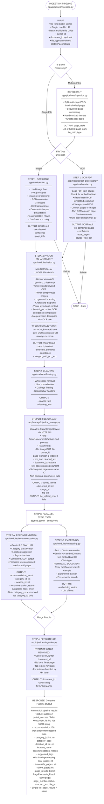
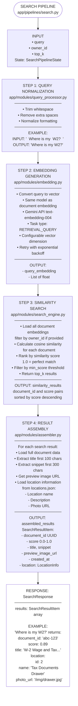

> **For Cursor AI**: This document serves as the **Master Plan and Context** for the `StorageHelperAIOrchestraService`.
> Please read this before generating code to understand the architecture, current progress, and task dependencies.

## 1. Service Overview
**StorageHelperAIOrchestraService** is the "brain" of the Home AI Paper Organizer. It does not handle direct user UI interactions or raw file storage (handled by WebService and DataStorageService respectively).

**Core Responsibilities:**
1.  **Orchestration**: Managing the lifecycle of a document processing request through modular, testable pipelines.
2.  **Ingestion Pipeline**: Image/PDF $\to$ OCR/Text Extraction $\to$ Text Cleaning $\to$ [Parallel: LLM Recommendation + Vector Embedding] $\to$ Persistence.
3.  **Search Pipeline**: User Query $\to$ Normalization $\to$ Vector Embedding $\to$ Cosine Similarity Search $\to$ Result Assembly (with Location context & previews).
4.  **Recommendation Engine**: LLM-powered (Gemini 2.5 Flash) intelligent document categorization and storage location suggestion with structured output.
5.  **Multi-Format Support**: Handles both image files (JPG, PNG, etc.) and PDF documents with intelligent processing.

---

## 2. Architecture & Data Flow

### 2.1 Ingestion Flow

The ingestion pipeline orchestrates the complete document processing workflow from image/PDF upload to storage. Implemented in `app/pipelines/ingestion.py` using a modular, testable architecture with dependency injection.

**Supported File Formats:**
- **Images**: JPG, JPEG, PNG, GIF, BMP, WEBP, TIFF
- **PDFs**: Single or multi-page PDF documents (up to 10 pages processed for performance)

**Batch Processing Support:**
- **Single File**: Use `file_urls` with one element: `["file1.jpg"]`
- **Multiple Files**: Use `file_urls` with multiple elements: `["file1.jpg", "file2.pdf", "file3.jpg"]`
- **Multi-page PDFs**: Automatically split into individual pages with sequential page numbering
- **Mixed Formats**: Supports combinations of images and PDFs in a single batch
- **Document ID Management**: First page establishes `document_id`, all subsequent pages use the same ID

#### Pipeline Architecture


```mermaid
flowchart TD
    Start([INGESTION PIPELINE<br/>app/pipelines/ingestion.py]) --> Input["INPUT<br/>• file_urls: List of strings<br/>  - Single: one file URL<br/>  - Batch: multiple file URLs<br/>• owner_id<br/>• document_id: optional<br/>• file_type auto-detect<br/>State: PipelineState"]
    
    Input --> BatchCheck{"Is Batch<br/>Processing?"}
    
    BatchCheck -->|Single File| FileType{"File Type<br/>Detection"}
    BatchCheck -->|Multiple Files| BatchSplit["BATCH SPLIT<br/>app/pipelines/ingestion.py<br/>─────────────────<br/>• Split multi-page PDFs<br/>  into individual pages<br/>• Sequential page numbering<br/>• Handle mixed formats<br/>• Create page tasks<br/>─────────────────<br/>OUTPUT: page_tasks<br/>  List of tuples: page_num, file_path, type"]
    
    BatchSplit --> FileType
    
    FileType -->|Image| OCR["STEP 1: OCR IMAGE<br/>app/modules/ocr.py<br/>─────────────────<br/>• Load image from URL/path/bytes<br/>• Image preprocessing:<br/>  - RGB conversion<br/>  - Grayscale<br/>  - Contrast enhance<br/>  - Denoise & sharpen<br/>  - Binarization<br/>• Tesseract OCR PSM 1<br/>• Confidence scoring<br/>─────────────────<br/>OUTPUT: OCRResult<br/>  - text cleaned<br/>  - confidence<br/>  - page_info"]
    
    FileType -->|PDF| PDFOCR["STEP 1: OCR PDF<br/>app/modules/pdf_processor.py<br/>app/modules/ocr.py<br/>─────────────────<br/>• Load PDF from source<br/>• Check for embedded text<br/>• If text-based PDF:<br/>  - Direct text extraction<br/>• If image-based PDF:<br/>  - Convert pages to images<br/>  - Run OCR on each page<br/>  - Combine results<br/>• Multi-page support max 10<br/>─────────────────<br/>OUTPUT: OCRResult<br/>  - text combined pages<br/>  - confidence<br/>  - total_pages<br/>  - source_type: pdf"]
    
    PDFOCR --> Vision
    OCR --> Vision["STEP 1B: VISION ENHANCEMENT<br/>app/modules/vision.py<br/>─────────────────<br/>MULTIMODAL AI UNDERSTANDING<br/>─────────────────<br/>• Gemini Vision API<br/>  gemini-2.0-flash-exp<br/>• Understands beyond OCR:<br/>  - Photos and product images<br/>  - Logos and branding<br/>  - Charts and diagrams<br/>  - Visual layout and context<br/>• Auto-trigger on low OCR<br/>  confidence configurable<br/>• Merges vision description<br/>  with OCR text<br/>─────────────────<br/>TRIGGER CONDITIONS:<br/>  - VISION_ENABLE=true<br/>  - Low OCR confidence OR<br/>  - Always-on mode<br/>─────────────────<br/>OUTPUT: VisionResult<br/>  - description text<br/>  - detected_elements<br/>  - confidence<br/>  - merged_with_ocr_text"]
    
    Vision --> Cleaning["STEP 2: CLEANING<br/>app/modules/cleaning.py<br/>─────────────────<br/>• Whitespace removal<br/>• Line normalization<br/>• Garbage filtering<br/>• Special char handling<br/>─────────────────<br/>OUTPUT:<br/>  - cleaned_text<br/>  - cleaning_info"]
    
    Cleaning --> Upload["STEP 2B: FILE UPLOAD<br/>app/storage/pipeline_storage.py<br/>─────────────────<br/>• Upload to DataStorageService<br/>  via HTTP API<br/>• POST /api/v1/documents/upload-and-process<br/>• Parameters:<br/>  - file: image/PDF file<br/>  - owner_id<br/>  - page_number: 1-indexed<br/>  - ocr_text: cleaned_text<br/>  - document_id: optional<br/>• First page creates document<br/>• Subsequent pages use same ID<br/>• Non-blocking, continues if fails<br/>─────────────────<br/>OUTPUT: upload_result<br/>  - document_id: int<br/>  - page_id<br/>  - file_url<br/>OUTPUT: file_upload_error if fails"]
    
    OCR -->|Failure| Stop1([STOP - Error])
    PDFOCR -->|Failure| Stop1
    
    style FileType fill:#0000
    style BatchCheck fill:#0000
    style BatchSplit fill:#0000
    
    Upload --> Parallel["STEP 3: PARALLEL EXECUTION<br/>asyncio.gather - concurrent"]
    
    Parallel --> Recommendation["STEP 3A: RECOMMENDATION<br/>app/modules/recommendation.py<br/>─────────────────<br/>• Gemini 2.5 Flash LLM<br/>• Category classification<br/>• Location suggestion<br/>• Tags extraction<br/>• Structured JSON output<br/>• For batch: uses combined<br/>  text from all pages<br/>─────────────────<br/>OUTPUT: recommendation_result<br/>  - category_id: int<br/>  - location_id: int<br/>  - recommendation_reason<br/>  - suggested_tags: array<br/>  - Note: category_code removed<br/>    use category_id only"]
    
    Parallel --> Embedding["STEP 3B: EMBEDDING<br/>app/modules/embedding.py<br/>─────────────────<br/>• Text → Vector conversion<br/>• Gemini API embedContent<br/>  text-embedding-004<br/>• Task type: RETRIEVAL_DOCUMENT<br/>• Retry mechanism: max 3 attempts<br/>• Exponential backoff<br/>• For semantic search<br/>─────────────────<br/>OUTPUT:<br/>  - embedding vector<br/>  - List of float"]
    
    Recommendation --> Merge{Merge Results}
    Embedding --> Merge
    
    Merge --> Persistence["STEP 4: PERSISTENCE<br/>app/pipelines/ingestion.py<br/>─────────────────<br/>STORAGE LOGIC REMOVED:<br/>• Generate UUID for document_id<br/>• No local file storage<br/>• No remote API calls<br/>• Persistence handled by API layer<br/>─────────────────<br/>OUTPUT: document_id UUID string<br/>for API response"]
    
    Persistence --> Response["RESPONSE: Complete Pipeline Output<br/>─────────────────<br/>Returns full pipeline results<br/>• status: success / partial_success / failed<br/>• document_id: int, not UUID string<br/>• recommendation: Dict with all recommendation data<br/>  - category_id: int, no category_code<br/>  - location_id: int, no location_name<br/>  - recommendation_reason<br/>  - suggested_tags<br/>• For batch processing:<br/>  - total_pages: int<br/>  - successful_pages: int<br/>  - failed_pages: int<br/>  - page_results: List of PageProcessingResult<br/>    Each page: page_number, status,<br/>    error, ocr_text, file_url<br/>• Single file: page_results = None"]
    
    style Start fill:#0000
    style Stop1 fill:#0000
    style Response fill:#0000
    style Parallel fill:#0000
    style Merge fill:#0000
```

#### Key Design Features

1. **Modular Architecture**: Each step is a separate method, making the pipeline highly testable and maintainable
2. **Dependency Injection**: All modules (OCR, vision, cleaning, recommendation, embedding, storage) are injected via constructor
3. **State Management**: `PipelineState` dataclass tracks all processing results and metadata throughout the pipeline
4. **Multimodal Intelligence**: Vision Enhancement (Step 1B) adds semantic understanding beyond OCR text extraction
5. **Batch Processing**: 
   - **Unified API**: Single `/ingestion` endpoint handles both single and batch uploads
   - **PDF Splitting**: Multi-page PDFs automatically split into individual pages with sequential numbering
   - **Document ID Management**: First page processed synchronously to establish `document_id`, remaining pages processed in parallel using the same ID
   - **Mixed Formats**: Supports combinations of images and PDFs in a single batch
   - **Page-level Results**: Each page tracked individually with status, OCR text, and error information
   - **Combined Recommendation**: All page texts combined for single recommendation and embedding generation
6. **Parallel Processing**: 
   - Steps 3A (Recommendation) and 3B (Embedding) run concurrently using `asyncio.gather()`
   - Batch processing: First page synchronous, remaining pages processed in parallel
6. **Error Resilience**: 
   - Cleaning failure doesn't stop pipeline (falls back to raw OCR text)
   - Vision enhancement failure doesn't stop pipeline (graceful degradation to OCR-only)
   - Recommendation and embedding failures are logged independently
   - File upload failure doesn't stop pipeline (AI processing continues, error tracked)
   - Pipeline continues to completion to retain partial results
   - Upload task properly cancelled if OCR fails to prevent resource leaks
7. **Storage Architecture**: 
   - **Local file storage removed**: No longer saves to tmp/documents/, tmp/embeddings/, tmp/images/, tmp/pdfs/, or index.json
   - **File upload integration**: Files uploaded to DataStorageService via HTTP API after cleaning step
   - **Upload API Format**: `POST /api/v1/documents/upload-and-process`
     - Parameters: `file`, `owner_id`, `page_number`, `ocr_text` (cleaned_text), `document_id` (optional)
     - First page: creates new document if `document_id` not provided
     - Subsequent pages: use same `document_id` from first page
   - **API-only persistence**: Storage logic removed from pipeline; persistence handled by API layer
   - **Unified output management**: `PipelineStorage` class provides methods to format and return complete pipeline results
   - **Output schema**: `DocumentOutputSchema` class manages output structure and field inclusion
   - **File upload error tracking**: Upload failures tracked per page without blocking AI processing
8. **Response Format**:
   - **Unified Structure**: Single response format for both single and batch processing
   - **Document ID**: Integer type (not UUID string) for consistency with database
   - **Recommendation Field**: All recommendation data in single `recommendation` Dict
     - Uses `category_id` (int) instead of `category_code` (string) to save space
     - Uses `location_id` (int) instead of `location_name` (string)
     - Removed redundant fields: `detected_type_code`, `recommended_location_id`, `recommended_location_reason`
   - **Batch Fields**: `total_pages`, `successful_pages`, `failed_pages`, `page_results` (only present for batch)
8. **Comprehensive Logging**: Each step logs progress, timing, and results for debugging and monitoring

#### Module Details

| Module | Location | Responsibility |
|--------|----------|----------------|
| **OCR Module** | `app/modules/ocr.py` | Image/PDF preprocessing, file type detection, Tesseract OCR, confidence scoring |
| **PDF Processor** | `app/modules/pdf_processor.py` | PDF loading, text extraction, PDF-to-image conversion, multi-page handling |
| **Vision Module** | `app/modules/vision.py` | 🆕 Multimodal understanding using Gemini Vision API - sees photos, logos, charts beyond OCR |
| **Cleaning Module** | `app/modules/cleaning.py` | Text normalization, noise removal, quality filtering |
| **Recommendation Module** | `app/modules/recommendation.py` | LLM-based category and location suggestion using Gemini API |
| **Embedding Module** | `app/modules/embedding.py` | Vector generation using Gemini API embedContent (text-embedding-004) with retry mechanism |
| **Pipeline Storage** | `app/storage/pipeline_storage.py` | Unified storage handler for all pipeline output results (API-based, no local files). Handles file uploads to DataStorageService via HTTP API. |
| **Output Schema** | `app/storage/output_schema.py` | Unified management of pipeline output structure and fields |

#### Vision Module Implementation Details

**🆕 NEW: Multimodal Vision Understanding**

The `VisionAnalyzer` class (`app/modules/vision.py`) is a breakthrough enhancement that addresses OCR's fundamental limitation: **traditional OCR can only "read text" but cannot "see images"**.

**Problem Statement:**
Traditional OCR (Tesseract) fails to understand:
- Product photos on warranty cards
- Company logos on invoices
- Charts and diagrams in reports
- Handwritten sketches or markings
- Complex layouts with mixed text and visuals

**Solution:**
Gemini Vision API (multimodal) can understand images holistically - both text AND visual content.

**API Configuration:**
- **Endpoint**: Gemini API `generateContent` endpoint
- **Model**: `gemini-2.0-flash-exp` (Google's latest multimodal model)
- **Capabilities**: 
  - Reads text with comparable accuracy to OCR
  - Describes photos, logos, charts, diagrams
  - Understands layout and visual context
  - Extracts semantic meaning from images

**Integration Strategy:**
1. **Smart Triggering**: Vision enhancement is optional and configurable
   - Auto-trigger when OCR confidence is low (< 0.6 by default)
   - OR always-on mode for maximum understanding
   - OR completely disabled for cost optimization
2. **Graceful Enhancement**: Vision runs AFTER OCR, enhancing (not replacing) it
   - OCR provides precise text extraction
   - Vision adds semantic understanding and visual context
   - Results are merged: `OCR Text + Vision Description`
3. **Error Resilience**: Vision failure doesn't stop the pipeline
   - Graceful degradation to OCR-only if Vision API fails
   - Cost-optimized: only runs when needed

**Configuration Options** (in `app/core/config.py`):
```python
VISION_ENABLE = True  # Master switch
VISION_AUTO_TRIGGER_ON_LOW_OCR = True  # Smart triggering
VISION_OCR_CONFIDENCE_THRESHOLD = 0.6  # Trigger threshold
VISION_MODEL = "gemini-2.0-flash-exp"
```

**Example Use Cases:**
- **Warranty Card with Product Photo**: OCR extracts warranty details, Vision identifies "Dyson V11 vacuum cleaner" from product image
- **Insurance Document with Logo**: OCR extracts policy text, Vision recognizes "Blue Cross Blue Shield logo"
- **Receipt with Faded Text**: OCR struggles (low confidence), Vision auto-triggers and recovers full content
- **Chart-Heavy Report**: OCR extracts titles, Vision describes "bar chart showing quarterly revenue growth"

#### Embedding Module Implementation Details

The `EmbeddingGenerator` class (`app/modules/embedding.py`) is a critical component for semantic search functionality:

**API Configuration:**
- **Endpoint**: Gemini API `embedContent` endpoint
- **Model**: `text-embedding-004` (Google's production embedding model)
- **Task Types**: 
  - `RETRIEVAL_DOCUMENT` for document ingestion
  - `RETRIEVAL_QUERY` for search queries (configurable)

**Key Features:**
1. **Retry Mechanism**: Implements exponential backoff with configurable max retries (default: 3)
   - Initial delay: 1 second
   - Exponential backoff: delay doubles after each failure
2. **Error Handling**: 
   - HTTP errors are caught and retried
   - Invalid responses trigger retries
   - Empty/whitespace text returns empty vector (no API call)
3. **Batch Processing**: `generate_batch()` method supports multiple texts
4. **Configurability**: 
   - Custom model name
   - API key injection
   - Task type selection
   - Timeout settings (default: 30s)

**Performance Considerations:**
- Asynchronous implementation using `httpx.AsyncClient`
- Timeout protection prevents hanging requests
- Graceful degradation on failures (logs errors, returns empty vector)

**Integration Pattern:**
```python
# Default instance for backward compatibility
generator = EmbeddingGenerator(
    model_name="text-embedding-004",
    api_key="",  # Configured via environment
    task_type="RETRIEVAL_DOCUMENT"
)
embedding = await generator.generate(text)
```

#### PDF Processing Details

The `pdf_processor` module (`app/modules/pdf_processor.py`) handles PDF document processing:

**Key Features:**
1. **Intelligent Processing**: Automatically detects if PDF has embedded text or is image-based
2. **Text Extraction**: For text-based PDFs, directly extracts text without OCR (faster, 100% accuracy)
3. **Image Conversion**: For image-based PDFs, converts pages to high-resolution images for OCR
4. **Multi-Page Support**: Processes up to 10 pages (configurable) to balance accuracy and performance
5. **PyMuPDF Integration**: Uses PyMuPDF (fitz) library for robust PDF handling

**Processing Methods:**
- **Text-based PDF**: Direct text extraction via `extract_text_from_pdf()`
- **Image-based PDF**: Page-by-page OCR via `convert_pdf_to_images()` + Tesseract OCR
- **Hybrid Approach**: Automatically selects best method via `process_pdf_for_ocr()`

**Performance Considerations:**
- DPI: 300 (configurable) for image rendering
- Max pages: 10 (default) to prevent long processing times
- Async implementation for non-blocking operations

#### Error Handling Strategy

- **OCR Failure**: Pipeline stops immediately, upload task cancelled, returns error status
- **PDF Processing Failure**: Pipeline stops, upload task cancelled, returns error status
- **File Upload Failure**: Continue with AI processing, set `file_upload_error` field, log warning
- **Vision Enhancement Failure**: 🆕 Continue with OCR text only (graceful degradation), log warning
- **Cleaning Failure**: Continue with raw OCR text, log warning
- **Recommendation Failure**: Log error, continue to completion with partial data
- **Embedding Failure**: Log error, continue to completion (search won't find this document)
- **Persistence Step**: Only generates UUID for document_id; actual persistence handled by API layer

### 2.2 Search Flow

The search pipeline enables semantic document discovery using natural language queries. Implemented in `app/pipelines/search.py` with vector similarity matching.

#### Pipeline Architecture


```mermaid
flowchart TD
    Start([SEARCH PIPELINE<br/>app/pipelines/search.py]) --> Input[INPUT<br/>• query<br/>• owner_id<br/>• top_k<br/>State: SearchPipelineState]
    
    Input --> Normalize[STEP 1: QUERY NORMALIZATION<br/>app/modules/query_processor.py<br/>─────────────────<br/>• Trim whitespace<br/>• Remove extra spaces<br/>• Normalize formatting<br/>─────────────────<br/>EXAMPLE:<br/>INPUT: '  Where is my  W2?  '<br/>OUTPUT: 'Where is my W2?']
    
    Normalize --> EmbedGen[STEP 2: EMBEDDING GENERATION<br/>app/modules/embedding.py<br/>─────────────────<br/>• Convert query to vector<br/>• Same model as document embedding<br/>• Gemini API text-embedding-004<br/>• Task type: RETRIEVAL_QUERY<br/>• Configurable vector dimension<br/>• Retry with exponential backoff<br/>─────────────────<br/>OUTPUT:<br/>  - query_embedding<br/>  - List of float]
    
    EmbedGen --> Search[STEP 3: SIMILARITY SEARCH<br/>app/modules/search_engine.py<br/>─────────────────<br/>• Load all document embeddings<br/>  filter by owner_id if provided<br/>• Calculate cosine similarity<br/>  for each document<br/>• Rank by similarity score<br/>  1.0 = perfect match<br/>• Filter by min_score threshold<br/>• Return top_k results<br/>─────────────────<br/>OUTPUT: similarity_results<br/>document_id and score pairs<br/>sorted by score descending]
    
    Search --> Assemble[STEP 4: RESULT ASSEMBLY<br/>app/modules/assembler.py<br/>─────────────────<br/>For each search result:<br/>• Load full document data<br/>• Extract title first 100 chars<br/>• Extract snippet first 300 chars<br/>• Get preview image URL<br/>• Load location information<br/>  from locations.json:<br/>  - Location name<br/>  - Description<br/>  - Photo URL<br/>─────────────────<br/>OUTPUT: assembled_results<br/>SearchResultItem:<br/>  - document_id UUID<br/>  - score 0.0-1.0<br/>  - title, snippet<br/>  - preview_image_url<br/>  - created_at<br/>  - location: LocationInfo]
    
    Assemble --> Response[RESPONSE: SearchResponse<br/>─────────────────<br/>results: SearchResultItem array<br/><br/>EXAMPLE:<br/>'Where is my W2?' returns:<br/>document_id: 'abc-123'<br/>score: 0.89<br/>title: 'W-2 Wage and Tax...'<br/>location:<br/>  id: 2<br/>  name: 'Tax Documents Drawer'<br/>  photo_url: '/img/drawer.jpg']
    
    style Start fill:#0000
    style Response fill:#0000
```

#### Key Design Features

1. **Semantic Search**: Uses vector embeddings for meaning-based matching, not just keyword search
2. **Cosine Similarity**: Measures document relevance by vector angle (0.0-1.0 score)
3. **Owner Isolation**: Optional owner_id filtering ensures multi-user privacy
4. **Rich Results**: Returns complete context including location photos and document previews
5. **Modular Pipeline**: Each step is independent and testable with dependency injection
6. **Performance Optimized**: 
   - Location data cached during result assembly
   - Results pre-sorted from search engine
   - Configurable top_k to limit processing

#### Search Quality Factors

| Factor | Impact | Implementation |
|--------|--------|----------------|
| **OCR Quality** | Higher confidence → Better searchability | Image preprocessing in ingestion |
| **Text Cleaning** | Removes noise → Cleaner embeddings | Whitespace/garbage removal |
| **Embedding Model** | Better model → More accurate matching | Gemini text-embedding-004 (production-grade) |
| **Query Normalization** | Consistent formatting → Reliable results | Whitespace trimming |
| **Similarity Threshold** | Adjustable precision/recall tradeoff | min_score parameter (default: 0.0) |

#### Example Search Flow

```
User Query: "medical bills from last year"
    ↓
Step 1: Normalize → "medical bills from last year"
    ↓
Step 2: Embed → [0.23, -0.45, 0.67, ..., 0.12] (768-dim)
    ↓
Step 3: Search → Find documents with embeddings:
    - Doc A (medical invoice): similarity = 0.87
    - Doc B (hospital bill): similarity = 0.82
    - Doc C (prescription): similarity = 0.76
    ↓
Step 4: Assemble → Add full details:
    [
      { doc_id: "...", title: "Hospital Invoice 2024", 
        location: "Medical Files Cabinet", score: 0.87 },
      { doc_id: "...", title: "Insurance Bill Q4", 
        location: "Medical Files Cabinet", score: 0.82 },
      ...
    ]
```

---

## 3. Implementation Plan & Progress Tracking

**Current Phase:** Phase 2 (AI Backend Implementation) - Near Completion
**Timeline:** Dec 11 – Dec 24
**Last Updated:** Dec 6, 2025

### 3.1 Setup & Infrastructure
- [x] **BE-01**: Initialize Python Project (FastAPI/Flask) & Env Setup
  - ✅ FastAPI application initialized in `main.py`
  - ✅ Configuration management implemented in `app/core/config.py`
  - ✅ Dependencies defined in `requirements.txt`
- [x] **BE-05**: Create Orchestration Controller (Entry points: `ingest`, `search`, `recommend`)
  - ✅ API router implemented in `app/api/router.py`
  - ✅ All three endpoints functional: `/ingestion`, `/search`, `/feedback`
  - ✅ Request/response schemas defined in `app/api/schemas.py`
- [x] **INF-01**: Setup basic logging (OCR errors, pipeline tracking)
  - ✅ Logging integrated across all modules
  - ✅ Pipeline step tracking implemented in ingestion and search pipelines

### 3.2 Ingestion Pipeline (Target: Dec 11–17)
- [x] **AI-01**: Select OCR Engine (Tesseract or Cloud API) & Test scripts
  - ✅ Tesseract OCR selected for MVP (cost-effective)
  - ✅ Tesseract binaries included in `app/modules/tesseract/`
  - ✅ Configurable via environment variables
- [x] **AI-02**: Implement `OCR Module`: `run_ocr(image_path) -> raw_text`
  - ✅ Full implementation in `app/modules/ocr.py`
  - ✅ Supports URL, local file path, and byte stream inputs
  - ✅ Image preprocessing pipeline (grayscale, contrast, denoising, binarization)
  - ✅ Confidence scoring and detailed OCR results
- [x] **AI-03**: Implement `Text Cleaning Module`: Noise removal, lowercase, truncation
  - ✅ Implementation in `app/modules/cleaning.py`
  - ✅ Whitespace normalization, garbage character removal
  - ✅ Low-confidence text filtering support
- [x] **AI-04**: Implement `Metadata Extractor`: Simple rules for Title, Date, Keywords
  - ✅ Integrated within recommendation module
  - ✅ Gemini LLM-based extraction of tags and category
- [x] **AI-05**: **Pipeline Integration**: Connect DB $\to$ OCR $\to$ Clean $\to$ Update DB
  - ✅ Complete pipeline orchestration in `app/pipelines/ingestion.py`
  - ✅ Modular step-by-step processing with state management
  - ✅ Local storage integration for document persistence
  - ✅ Embedding generation and storage support

### 3.3 Search & Recommendation (Target: Dec 18–24)
- [x] **AI-06**: Implement `Query Normalization`: Trim, lowercase, stop-words
  - ✅ Implementation in `app/modules/query_processor.py`
  - ✅ Whitespace normalization and query cleaning
- [x] **AI-07**: Implement `Search Logic`: DB query execution (Text match)
  - ✅ Vector similarity search implemented in `app/modules/search_engine.py`
  - ✅ Cosine similarity calculation for semantic search
  - ✅ Embedding-based document matching
  - ✅ Owner-based filtering and top-k ranking
- [x] **AI-08**: Implement `Result Assembler`: Formatting response with Document + Location Image URL
  - ✅ Implementation in `app/modules/assembler.py`
  - ✅ Enriches search results with document metadata
  - ✅ Includes location information (name, description, photo URL)
  - ✅ Generates title snippets from extracted text
- [x] **AI-09**: Implement `Location Recommendation`: Rule-based logic (Keyword $\to$ LocationID)
  - ✅ Advanced LLM-based recommendation in `app/modules/recommendation.py`
  - ✅ Uses Gemini 2.5 Flash for intelligent category and location suggestions
  - ✅ Structured output with category codes, location IDs, and reasoning
  - ✅ Support for new category creation
- [ ] **AI-11**: Implement `Feedback Handler`: API to record user feedback signals
  - ⚠️ API endpoint exists but handler not fully implemented
  - ⚠️ Current implementation in `app/pipelines/feedback.py` raises NotImplementedError

### 3.4 QA & Testing
- [ ] **QA-01**: Unit Tests for OCR Wrapper & Text Cleaner
  - ⚠️ No test files found in codebase
- [ ] **QA-02**: Integration Test Script (End-to-End: Upload to Search)
  - ⚠️ No integration tests found in codebase

### Summary
**Completion Status: 15/17 tasks completed (88%)**
- **Completed:** Core ingestion pipeline, search pipeline, and recommendation system
- **Remaining:** Feedback handler implementation and comprehensive testing suite

---

## 4. API Interface Contracts (Internal Draft)

### Endpoints

#### POST `/api/v1/ingestion`
**Unified ingestion endpoint for single and batch processing**

**Request:**
```json
{
  "document_id": null,  // Optional: existing document ID
  "file_urls": ["file1.jpg", "file2.pdf"],  // List of file URLs (single: length 1)
  "owner_id": 1,
  "user_notes": "Optional user notes"
}
```

**Response (Single File):**
```json
{
  "status": "success",
  "document_id": 6,
  "recommendation": {
    "category_id": 3,
    "location_id": 1,
    "recommendation_reason": "The document is...",
    "suggested_tags": ["tag1", "tag2"]
  },
  "total_pages": null,
  "successful_pages": null,
  "failed_pages": null,
  "page_results": null
}
```

**Response (Batch Processing):**
```json
{
  "status": "success",
  "document_id": 6,
  "recommendation": {
    "category_id": 3,
    "location_id": 1,
    "recommendation_reason": "Combined analysis of all pages...",
    "suggested_tags": ["tag1", "tag2"]
  },
  "total_pages": 3,
  "successful_pages": 3,
  "failed_pages": 0,
  "page_results": [
    {
      "page_number": 1,
      "status": "success",
      "error": null,
      "ocr_text": "Extracted text...",
      "file_url": "http://..."
    },
    {
      "page_number": 2,
      "status": "success",
      "error": null,
      "ocr_text": "Extracted text...",
      "file_url": "http://..."
    }
  ]
}
```

**Key Features:**
- **Unified API**: Single endpoint handles both single file (`file_urls` length 1) and batch processing
- **PDF Splitting**: Multi-page PDFs automatically split into pages with sequential numbering
- **Document ID**: Integer type, first page establishes ID, subsequent pages use same ID
- **Recommendation**: All recommendation data in single `recommendation` field
  - Uses IDs (`category_id`, `location_id`) instead of codes/names to save space
  - Removed redundant fields for cleaner response

---

## 5. File Structure
*(Please update this tree as we create files to keep context fresh)*

```text
StorageHelperAIOrchestraService/
├── app/
│   ├── api/                    # REST API layer
│   │   ├── __init__.py
│   │   ├── router.py           # API route definitions
│   │   └── schemas.py          # Pydantic request/response models
│   ├── core/                   # Core configurations
│   │   ├── __init__.py
│   │   ├── category_config.py  # Document category definitions
│   │   └── config.py           # Service configuration
│   ├── modules/                # Business logic modules
│   │   ├── __init__.py
│   │   ├── assembler.py        # Search result assembly
│   │   ├── cleaning.py         # Text cleaning & normalization
│   │   ├── embedding.py        # Vector embedding generation
│   │   ├── ocr.py              # OCR engine wrapper (image + PDF)
│   │   ├── pdf_processor.py    # PDF processing & conversion
│   │   ├── query_processor.py  # Query normalization
│   │   ├── recommendation.py   # Location recommendation logic
│   │   ├── search_engine.py    # Search execution & ranking
│   │   ├── vision.py           # 🆕 Vision AI for multimodal understanding
│   │   └── tesseract/          # Tesseract OCR binaries & data
│   ├── pipelines/              # Orchestration workflows
│   │   ├── __init__.py
│   │   ├── feedback.py         # User feedback processing
│   │   ├── ingestion.py        # Document ingestion pipeline
│   │   └── search.py           # Search pipeline
│   └── storage/                # Pipeline output storage management
│       ├── __init__.py
│       ├── pipeline_storage.py # Unified storage handler for pipeline results (API-based)
│       └── output_schema.py    # Unified output structure management
├── tmp/                        # Runtime temporary storage (deprecated)
│   ├── Storage/                # Configuration data (still used by AI orchestration)
│   │   ├── document_categories.json
│   │   ├── locations.json
│   │   └── README.md
│   └── README.md
├── main.py                     # FastAPI application entry point
├── requirements.txt            # Python dependencies
└── README.md                   # Service documentation
```

---

## 6. Development Log / Notes
*   **Project Initialization**: FastAPI-based service architecture established with modular pipeline design
*   **OCR Engine Selection**: Chose Tesseract OCR for MVP to minimize costs and enable offline processing
    - Bundled Tesseract binaries with application for easy deployment
    - Implemented comprehensive image preprocessing for better accuracy
    - PSM mode 1 (auto with OSD) for handling rotated/oriented documents
*   **Recommendation System**: Upgraded from rule-based to LLM-powered recommendations
    - Integrated Gemini 2.5 Flash API for intelligent document categorization
    - Structured output schema ensures consistent recommendation format
    - Support for dynamic category creation when existing categories don't match
*   **Embedding System**: Vector generation using Gemini API for semantic search
    - Integrated Gemini API text-embedding-004 model (production-grade)
    - Configurable task types: RETRIEVAL_DOCUMENT for ingestion, RETRIEVAL_QUERY for search
    - Robust retry mechanism with exponential backoff (max 3 attempts, 30s timeout)
    - Batch processing support for multiple documents
    - Asynchronous implementation for non-blocking operations
*   **Search Implementation**: Semantic vector search using cosine similarity
    - Vector embeddings enable meaning-based matching (not just keywords)
    - Cosine similarity algorithm for document ranking (0.0-1.0 score)
    - Local storage implementation for MVP (file-based)
    - Result assembly includes location context and preview images
    - Owner-based filtering for multi-user privacy
*   **Pipeline Architecture**: Implemented modular, testable pipeline design
    - Dependency injection for all modules (OCR, cleaning, embedding, storage)
    - State management pattern for tracking processing steps
    - Comprehensive error handling and logging throughout
*   **Storage Architecture Refactoring** (December 5, 2025):
    - **Removed Local File Storage**: Eliminated all local file operations (tmp/documents/, tmp/embeddings/, tmp/images/, tmp/pdfs/, index.json)
    - **Unified Pipeline Storage**: Created `PipelineStorage` class to handle all pipeline output results via API
    - **Output Schema Management**: Added `DocumentOutputSchema` class for unified output structure management
    - **API Integration**: All storage operations now handled via remote API (DataStorageService)
    - **Simplified Pipeline**: Ingestion pipeline no longer handles persistence; only generates UUID for document_id
    - **Complete API Response**: `/api/v1/ingestion` now returns full pipeline output via `PipelineStorage.get_pipeline_output()`
    - **Removed Integrations Folder**: Consolidated `storage_client.py` functionality into `pipeline_storage.py`
    - **Backward Compatibility**: Maintained convenience functions and class interfaces for smooth transition
*   **PDF Support Implementation** (December 3, 2025):
    - Added comprehensive PDF processing capability to handle both image and text-based PDFs
    - Created `pdf_processor.py` module with PyMuPDF integration
    - Extended OCR module with automatic file type detection (image vs PDF)
    - Intelligent processing: direct text extraction for text-based PDFs, OCR for image-based
    - Multi-page support (up to 10 pages) with page-by-page processing
    - Updated storage module to handle both image and PDF files
    - Enhanced API schemas to support `file_type` parameter
    - Modified ingestion pipeline to auto-detect and route files appropriately
    - Search functionality fully compatible with PDF documents
    - Backward compatible: existing image processing unchanged
*   **Vision Enhancement Implementation** (December 4, 2025):
    - **Major Feature**: Added multimodal vision understanding to address OCR's fundamental limitation
    - **Problem Identified**: Traditional OCR can only "read text" but cannot "see images" (photos, logos, charts, complex layouts)
    - **Solution**: Integrated Gemini Vision API (`gemini-2.0-flash-exp`) for holistic image understanding
    - Created `app/modules/vision.py` with `VisionAnalyzer` class
    - **Smart Integration Strategy**:
      - Vision runs as optional Step 1B (between OCR and Cleaning)
      - Configurable trigger: auto-enable on low OCR confidence OR always-on OR disabled
      - Graceful enhancement: Vision augments (not replaces) OCR
      - Results merged: `OCR Text + Vision Description` for richer semantic understanding
      - Error resilient: Vision failure doesn't stop pipeline (degrades to OCR-only)
    - **Configuration Added** (`app/core/config.py`):
      - `VISION_ENABLE`: Master switch (default: True)
      - `VISION_AUTO_TRIGGER_ON_LOW_OCR`: Smart triggering (default: True)
      - `VISION_OCR_CONFIDENCE_THRESHOLD`: Trigger threshold (default: 0.6)
      - `VISION_MODEL`: Model selection (default: gemini-2.0-flash-exp)
    - **Pipeline Updated** (`app/pipelines/ingestion.py`):
      - Added `step_vision_enhancement()` method
      - Integrated into main pipeline flow
      - Enhanced `PipelineState` with `vision_result` field
    - **Use Cases Enabled**:
      - Product warranty cards with photos
      - Insurance documents with logos
      - Receipts with faded/low-quality text
      - Reports with charts and diagrams
      - Mixed text-image documents
    - **Architecture Benefit**: Modular design allows easy enable/disable for cost optimization
    - **Documentation**: Updated design document with Vision Enhancement architecture
*   **Storage Architecture Migration** (December 5, 2025):
    - **Architecture Change**: Migrated from local file-based storage to API-only persistence
    - **PipelineStorage Class**: Unified handler for all pipeline output results
      - Handles ingestion pipeline results (OCR, vision, recommendations, embeddings)
      - Handles search pipeline results
      - Provides `get_pipeline_output()` method to return complete pipeline data
      - All operations via remote API (no local file operations)
    - **Output Schema System**: Created `DocumentOutputSchema` for unified output management
      - Controls which fields are included in output
      - Supports field mapping and exclusion
      - Used by `PipelineState.to_output_dict()` for consistent output format
    - **API Response Enhancement**: `/api/v1/ingestion` now returns complete pipeline output
      - Includes all processing steps and results
      - OCR text, vision analysis, recommendations, embeddings
      - Full metadata and processing information
    - **Code Cleanup**: 
      - Removed `app/integrations/` folder (functionality merged into `pipeline_storage.py`)
      - Removed `app/storage/local_storage.py` (local file operations disabled)
      - Removed `app/storage/migrate_embeddings.py` (no longer needed)
*   **File Upload Integration** (December 6, 2025):
    - **Parallel File Upload**: Files uploaded to DataStorageService during OCR step
      - Upload runs in parallel with OCR processing for efficiency
      - Uses HTTP API: `POST /api/v1/documents/upload-and-process`
      - Microservice communication: No direct code dependencies, pure HTTP
    - **Error Handling**: 
      - File upload failure doesn't block AI processing
      - `file_upload_error` field tracks upload failures separately
      - Upload task properly cancelled if OCR fails to prevent resource leaks
    - **Output Fields**: 
      - `file_url`: URL of file stored in database (from upload response)
      - `file_upload_error`: Error message if upload failed (AI processing succeeded)
    - **Configuration**: 
      - `STORAGE_SERVICE_URL` configures DataStorageService endpoint
      - Default: `http://localhost:8000/internal` (extracted to `http://localhost:8000` for public API)
    - **Dependencies**: Added `aiofiles==24.1.0` for async file reading
*   **Batch Processing Implementation** (December 6, 2025):
    - **Unified Ingestion API**: Single `/ingestion` endpoint handles both single and batch uploads
      - Request format: `file_urls: List[str]` (single file = list with one element)
      - Automatically routes to single-file or batch processing pipeline
    - **PDF Splitting**: Multi-page PDFs automatically split into individual pages
      - Sequential page numbering (1-indexed)
      - Temporary file management for PDF page images
      - Supports multiple PDFs, multiple images, or mixed formats in single batch
    - **Document ID Management**: 
      - First page processed synchronously to establish `document_id`
      - Subsequent pages processed in parallel using the same `document_id`
      - Ensures all pages belong to the same document
    - **Page-level Processing**: Each page tracked individually
      - Status: 'success', 'failed', 'skipped'
      - OCR text, file URL, error messages per page
      - Combined text from all pages used for single recommendation/embedding
    - **Response Format**: Unified response structure
      - `document_id`: Integer type (not UUID string)
      - `recommendation`: Single Dict containing all recommendation data
      - Batch fields: `total_pages`, `successful_pages`, `failed_pages`, `page_results`
*   **API Response Format Refactoring** (December 6, 2025):
    - **Simplified Response Structure**: 
      - Removed `detected_type_code` field (use `category_id` in recommendation)
      - Removed `recommended_location_id` and `recommended_location_reason` (moved to recommendation)
      - Renamed `extracted_metadata` to `recommendation` (contains all recommendation data)
      - Removed `category_code` from recommendation (use `category_id` only to save space)
    - **ID-based Fields**: 
      - Use `category_id` (int) instead of `category_code` (string)
      - Use `location_id` (int) instead of `location_name` (string)
      - Removed redundant name/code fields to reduce response size
    - **Unified Recommendation Field**: All recommendation information consolidated in single `recommendation` Dict
      - Includes: `category_id`, `location_id`, `recommendation_reason`, `suggested_tags`, etc.
      - Normalized location fields: prefers `location_id` over `suggested_location_id`
      - Removes `location_name` and `suggested_location_name` fields
*   **File Upload API Integration** (December 6, 2025):
    - **Updated Upload Format**: Modified to match new DataStorageService API
      - Endpoint: `POST /api/v1/documents/upload-and-process`
      - Parameters: `file`, `owner_id`, `page_number`, `ocr_text` (cleaned_text), `document_id` (optional)
      - Response: `document_id` (int), `page_id`
    - **Upload Timing**: Moved from OCR step to after Cleaning step
      - Ensures `cleaned_text` is available for upload
      - Uses `cleaning_info.cleaned_text` from PipelineStorage
    - **Document ID Handling**: 
      - If `document_id` provided: uses it for all pages
      - If empty: first page creates new document, subsequent pages use returned ID
      - Properly extracts `document_id` from upload response (key: `'document_id'`, not `'id'`)
*   **Pending Work**: 
    - Feedback handler implementation (endpoint exists, storage logic removed, needs API integration)
    - Comprehensive test suite (unit and integration tests)
    - Production deployment configurations
    - Performance testing and cost analysis for Vision API usage

---

### **Instructions for Cursor**
1.  **Check the Task List**: Before starting a task, verify dependencies.
2.  **Follow the Architecture**: Do not put business logic in the API routes; put them in `pipelines/` or `modules/`.
3.  **Update this File**: When a feature is completed, mark the checkbox `[x]` and update the File Structure if new files were added.