```mermaid
flowchart TD
    Start([INGESTION PIPELINE<br/>app/pipelines/ingestion.py]) --> Input[INPUT<br/>• image_url file path<br/>• owner_id<br/>• document_id<br/>• file_type auto-detect<br/>State: PipelineState]
    
    Input --> FileType{File Type<br/>Detection}
    
    FileType -->|Image| OCR[STEP 1: OCR IMAGE<br/>app/modules/ocr.py<br/>─────────────────<br/>• Load image from URL/path/bytes<br/>• Image preprocessing:<br/>  - RGB conversion<br/>  - Grayscale<br/>  - Contrast enhance<br/>  - Denoise & sharpen<br/>  - Binarization<br/>• Tesseract OCR PSM 1<br/>• Confidence scoring<br/>─────────────────<br/>OUTPUT: OCRResult<br/>  - text cleaned<br/>  - confidence<br/>  - page_info]
    
    FileType -->|PDF| PDFOCR[STEP 1: OCR PDF<br/>app/modules/pdf_processor.py<br/>app/modules/ocr.py<br/>─────────────────<br/>• Load PDF from source<br/>• Check for embedded text<br/>• If text-based PDF:<br/>  - Direct text extraction<br/>• If image-based PDF:<br/>  - Convert pages to images<br/>  - Run OCR on each page<br/>  - Combine results<br/>• Multi-page support max 10<br/>─────────────────<br/>OUTPUT: OCRResult<br/>  - text combined pages<br/>  - confidence<br/>  - total_pages<br/>  - source_type: pdf]
    
    PDFOCR --> Vision
    OCR --> Vision[STEP 1B: VISION ENHANCEMENT<br/>app/modules/vision.py<br/>OPTIONAL - CONFIGURABLE]
    
    Vision[STEP 1B: VISION ENHANCEMENT<br/>app/modules/vision.py<br/>─────────────────<br/>🔍 MULTIMODAL AI UNDERSTANDING<br/>─────────────────<br/>• Gemini Vision API<br/>  gemini-2.0-flash-exp<br/>• Understands beyond OCR:<br/>  - Photos & product images<br/>  - Logos & branding<br/>  - Charts & diagrams<br/>  - Visual layout & context<br/>• Auto-trigger on low OCR<br/>  confidence configurable<br/>• Merges vision description<br/>  with OCR text<br/>─────────────────<br/>TRIGGER CONDITIONS:<br/>  - VISION_ENABLE=true<br/>  - Low OCR confidence OR<br/>  - Always-on mode<br/>─────────────────<br/>OUTPUT: VisionResult<br/>  - description text<br/>  - detected_elements<br/>  - confidence<br/>  - merged_with_ocr_text]
    
    Vision --> Cleaning[STEP 2: CLEANING<br/>app/modules/cleaning.py]
    
    Cleaning[STEP 2: CLEANING<br/>app/modules/cleaning.py<br/>─────────────────<br/>• Whitespace removal<br/>• Line normalization<br/>• Garbage filtering<br/>• Special char handling<br/>─────────────────<br/>OUTPUT:<br/>  - cleaned_text<br/>  - cleaning_info]
    
    OCR -->|Failure| Stop1([STOP - Error])
    PDFOCR -->|Failure| Stop1
    
    style FileType fill:#0000
    
    Cleaning --> Parallel[STEP 3: PARALLEL EXECUTION<br/>asyncio.gather - concurrent]
    
    Parallel --> Recommendation[STEP 3A: RECOMMENDATION<br/>app/modules/recommendation.py<br/>─────────────────<br/>• Gemini 2.5 Flash LLM<br/>• Category classification<br/>• Location suggestion<br/>• Tags extraction<br/>• Structured JSON output<br/>─────────────────<br/>OUTPUT: recommendation_result<br/>  - category_code<br/>  - location_id<br/>  - location_name<br/>  - tags array<br/>  - reason]
    
    Parallel --> Embedding[STEP 3B: EMBEDDING<br/>app/modules/embedding.py<br/>─────────────────<br/>• Text → Vector conversion<br/>• Gemini API embedContent<br/>  text-embedding-004<br/>• Task type: RETRIEVAL_DOCUMENT<br/>• Retry mechanism: max 3 attempts<br/>• Exponential backoff<br/>• For semantic search<br/>─────────────────<br/>OUTPUT:<br/>  - embedding vector<br/>  - List of float]
    
    Recommendation --> Merge{Merge Results}
    Embedding --> Merge
    
    Merge --> Persistence[STEP 4: PERSISTENCE<br/>app/storage/local_storage.py<br/>─────────────────<br/>LOCAL STORAGE:<br/>• Generate UUID<br/>• Save document JSON tmp/documents/<br/>• Save embedding tmp/embeddings/<br/>• Save file tmp/images/ or tmp/pdfs/<br/>• Update index.json<br/>REMOTE STORAGE:<br/>• Call storage_client optional<br/>• Persist to DB if available<br/>─────────────────<br/>OUTPUT: document_id UUID string]
    
    Persistence --> Response[RESPONSE: IngestResponse<br/>─────────────────<br/>• status: completed<br/>• document_id: UUID<br/>• detected_type_code<br/>• extracted_metadata<br/>• recommended_location_id<br/>• recommended_location_reason]
    
    style Start fill:#0000
    style Stop1 fill:#0000
    style Response fill:#0000
    style Parallel fill:#0000
    style Merge fill:#0000
```

```mermaid
flowchart TD
    Start([SEARCH PIPELINE<br/>app/pipelines/search.py]) --> Input[INPUT<br/>• query<br/>• owner_id<br/>• top_k<br/>State: SearchPipelineState]
    
    Input --> Normalize[STEP 1: QUERY NORMALIZATION<br/>app/modules/query_processor.py<br/>─────────────────<br/>• Trim whitespace<br/>• Remove extra spaces<br/>• Normalize formatting<br/>─────────────────<br/>EXAMPLE:<br/>INPUT: '  Where is my  W2?  '<br/>OUTPUT: 'Where is my W2?']
    
    Normalize --> EmbedGen[STEP 2: EMBEDDING GENERATION<br/>app/modules/embedding.py<br/>─────────────────<br/>• Convert query to vector<br/>• Same model as document embedding<br/>• Gemini API text-embedding-004<br/>• Task type: RETRIEVAL_QUERY<br/>• Configurable vector dimension<br/>• Retry with exponential backoff<br/>─────────────────<br/>OUTPUT:<br/>  - query_embedding<br/>  - List of float]
    
    EmbedGen --> Search[STEP 3: SIMILARITY SEARCH<br/>app/modules/search_engine.py<br/>─────────────────<br/>• Load all document embeddings<br/>  filter by owner_id if provided<br/>• Calculate cosine similarity<br/>  for each document<br/>• Rank by similarity score<br/>  1.0 = perfect match<br/>• Filter by min_score threshold<br/>• Return top_k results<br/>─────────────────<br/>OUTPUT: similarity_results<br/>document_id and score pairs<br/>sorted by score descending]
    
    Search --> Assemble[STEP 4: RESULT ASSEMBLY<br/>app/modules/assembler.py<br/>─────────────────<br/>For each search result:<br/>• Load full document data<br/>• Extract title first 100 chars<br/>• Extract snippet first 300 chars<br/>• Get preview image URL<br/>• Load location information<br/>  from locations.json:<br/>  - Location name<br/>  - Description<br/>  - Photo URL<br/>─────────────────<br/>OUTPUT: assembled_results<br/>SearchResultItem:<br/>  - document_id UUID<br/>  - score 0.0-1.0<br/>  - title, snippet<br/>  - preview_image_url<br/>  - created_at<br/>  - location: LocationInfo]
    
    Assemble --> Response[RESPONSE: SearchResponse<br/>─────────────────<br/>results: SearchResultItem array<br/><br/>EXAMPLE:<br/>'Where is my W2?' returns:<br/>document_id: 'abc-123'<br/>score: 0.89<br/>title: 'W-2 Wage and Tax...'<br/>location:<br/>  id: 2<br/>  name: 'Tax Documents Drawer'<br/>  photo_url: '/img/drawer.jpg']
    
    style Start fill:#0000
    style Response fill:#0000
```

> **For Cursor AI**: This document serves as the **Master Plan and Context** for the `StorageHelperAIOrchestraService`.
> Please read this before generating code to understand the architecture, current progress, and task dependencies.

## 1. Service Overview
**StorageHelperAIOrchestraService** is the "brain" of the Home AI Paper Organizer. It does not handle direct user UI interactions or raw file storage (handled by WebService and DataStorageService respectively).

**Core Responsibilities:**
1.  **Orchestration**: Managing the lifecycle of a document processing request through modular, testable pipelines.
2.  **Ingestion Pipeline**: Image/PDF $\to$ OCR/Text Extraction $\to$ Text Cleaning $\to$ [Parallel: LLM Recommendation + Vector Embedding] $\to$ Persistence.
3.  **Search Pipeline**: User Query $\to$ Normalization $\to$ Vector Embedding $\to$ Cosine Similarity Search $\to$ Result Assembly (with Location context & previews).
4.  **Recommendation Engine**: LLM-powered (Gemini 2.5 Flash) intelligent document categorization and storage location suggestion with structured output.
5.  **Multi-Format Support**: Handles both image files (JPG, PNG, etc.) and PDF documents with intelligent processing.

---

## 2. Architecture & Data Flow

### 2.1 Ingestion Flow

The ingestion pipeline orchestrates the complete document processing workflow from image/PDF upload to storage. Implemented in `app/pipelines/ingestion.py` using a modular, testable architecture with dependency injection.

**Supported File Formats:**
- **Images**: JPG, JPEG, PNG, GIF, BMP, WEBP, TIFF
- **PDFs**: Single or multi-page PDF documents (up to 10 pages processed for performance)

#### Pipeline Architecture



#### Key Design Features

1. **Modular Architecture**: Each step is a separate method, making the pipeline highly testable and maintainable
2. **Dependency Injection**: All modules (OCR, vision, cleaning, recommendation, embedding, storage) are injected via constructor
3. **State Management**: `PipelineState` dataclass tracks all processing results and metadata throughout the pipeline
4. **Multimodal Intelligence**: Vision Enhancement (Step 1B) adds semantic understanding beyond OCR text extraction
5. **Parallel Processing**: Steps 3A (Recommendation) and 3B (Embedding) run concurrently using `asyncio.gather()`
6. **Error Resilience**: 
   - Cleaning failure doesn't stop pipeline (falls back to raw OCR text)
   - Vision enhancement failure doesn't stop pipeline (graceful degradation to OCR-only)
   - Recommendation and embedding failures are logged independently
   - Pipeline continues to persistence to retain partial results
7. **Comprehensive Logging**: Each step logs progress, timing, and results for debugging and monitoring

#### Module Details

| Module | Location | Responsibility |
|--------|----------|----------------|
| **OCR Module** | `app/modules/ocr.py` | Image/PDF preprocessing, file type detection, Tesseract OCR, confidence scoring |
| **PDF Processor** | `app/modules/pdf_processor.py` | PDF loading, text extraction, PDF-to-image conversion, multi-page handling |
| **Vision Module** | `app/modules/vision.py` | 🆕 Multimodal understanding using Gemini Vision API - sees photos, logos, charts beyond OCR |
| **Cleaning Module** | `app/modules/cleaning.py` | Text normalization, noise removal, quality filtering |
| **Recommendation Module** | `app/modules/recommendation.py` | LLM-based category and location suggestion using Gemini API |
| **Embedding Module** | `app/modules/embedding.py` | Vector generation using Gemini API embedContent (text-embedding-004) with retry mechanism |
| **Storage Client** | `app/integrations/storage_client.py` | Interface to DataStorageService (optional) |
| **Local Storage** | `app/storage/local_storage.py` | File-based persistence (documents, embeddings, images, PDFs, index) |

#### Vision Module Implementation Details

**🆕 NEW: Multimodal Vision Understanding**

The `VisionAnalyzer` class (`app/modules/vision.py`) is a breakthrough enhancement that addresses OCR's fundamental limitation: **traditional OCR can only "read text" but cannot "see images"**.

**Problem Statement:**
Traditional OCR (Tesseract) fails to understand:
- Product photos on warranty cards
- Company logos on invoices
- Charts and diagrams in reports
- Handwritten sketches or markings
- Complex layouts with mixed text and visuals

**Solution:**
Gemini Vision API (multimodal) can understand images holistically - both text AND visual content.

**API Configuration:**
- **Endpoint**: Gemini API `generateContent` endpoint
- **Model**: `gemini-2.0-flash-exp` (Google's latest multimodal model)
- **Capabilities**: 
  - Reads text with comparable accuracy to OCR
  - Describes photos, logos, charts, diagrams
  - Understands layout and visual context
  - Extracts semantic meaning from images

**Integration Strategy:**
1. **Smart Triggering**: Vision enhancement is optional and configurable
   - Auto-trigger when OCR confidence is low (< 0.6 by default)
   - OR always-on mode for maximum understanding
   - OR completely disabled for cost optimization
2. **Graceful Enhancement**: Vision runs AFTER OCR, enhancing (not replacing) it
   - OCR provides precise text extraction
   - Vision adds semantic understanding and visual context
   - Results are merged: `OCR Text + Vision Description`
3. **Error Resilience**: Vision failure doesn't stop the pipeline
   - Graceful degradation to OCR-only if Vision API fails
   - Cost-optimized: only runs when needed

**Configuration Options** (in `app/core/config.py`):
```python
VISION_ENABLE = True  # Master switch
VISION_AUTO_TRIGGER_ON_LOW_OCR = True  # Smart triggering
VISION_OCR_CONFIDENCE_THRESHOLD = 0.6  # Trigger threshold
VISION_MODEL = "gemini-2.0-flash-exp"
```

**Example Use Cases:**
- **Warranty Card with Product Photo**: OCR extracts warranty details, Vision identifies "Dyson V11 vacuum cleaner" from product image
- **Insurance Document with Logo**: OCR extracts policy text, Vision recognizes "Blue Cross Blue Shield logo"
- **Receipt with Faded Text**: OCR struggles (low confidence), Vision auto-triggers and recovers full content
- **Chart-Heavy Report**: OCR extracts titles, Vision describes "bar chart showing quarterly revenue growth"

#### Embedding Module Implementation Details

The `EmbeddingGenerator` class (`app/modules/embedding.py`) is a critical component for semantic search functionality:

**API Configuration:**
- **Endpoint**: Gemini API `embedContent` endpoint
- **Model**: `text-embedding-004` (Google's production embedding model)
- **Task Types**: 
  - `RETRIEVAL_DOCUMENT` for document ingestion
  - `RETRIEVAL_QUERY` for search queries (configurable)

**Key Features:**
1. **Retry Mechanism**: Implements exponential backoff with configurable max retries (default: 3)
   - Initial delay: 1 second
   - Exponential backoff: delay doubles after each failure
2. **Error Handling**: 
   - HTTP errors are caught and retried
   - Invalid responses trigger retries
   - Empty/whitespace text returns empty vector (no API call)
3. **Batch Processing**: `generate_batch()` method supports multiple texts
4. **Configurability**: 
   - Custom model name
   - API key injection
   - Task type selection
   - Timeout settings (default: 30s)

**Performance Considerations:**
- Asynchronous implementation using `httpx.AsyncClient`
- Timeout protection prevents hanging requests
- Graceful degradation on failures (logs errors, returns empty vector)

**Integration Pattern:**
```python
# Default instance for backward compatibility
generator = EmbeddingGenerator(
    model_name="text-embedding-004",
    api_key="",  # Configured via environment
    task_type="RETRIEVAL_DOCUMENT"
)
embedding = await generator.generate(text)
```

#### PDF Processing Details

The `pdf_processor` module (`app/modules/pdf_processor.py`) handles PDF document processing:

**Key Features:**
1. **Intelligent Processing**: Automatically detects if PDF has embedded text or is image-based
2. **Text Extraction**: For text-based PDFs, directly extracts text without OCR (faster, 100% accuracy)
3. **Image Conversion**: For image-based PDFs, converts pages to high-resolution images for OCR
4. **Multi-Page Support**: Processes up to 10 pages (configurable) to balance accuracy and performance
5. **PyMuPDF Integration**: Uses PyMuPDF (fitz) library for robust PDF handling

**Processing Methods:**
- **Text-based PDF**: Direct text extraction via `extract_text_from_pdf()`
- **Image-based PDF**: Page-by-page OCR via `convert_pdf_to_images()` + Tesseract OCR
- **Hybrid Approach**: Automatically selects best method via `process_pdf_for_ocr()`

**Performance Considerations:**
- DPI: 300 (configurable) for image rendering
- Max pages: 10 (default) to prevent long processing times
- Async implementation for non-blocking operations

#### Error Handling Strategy

- **OCR Failure**: Pipeline stops immediately, returns error status
- **PDF Processing Failure**: Pipeline stops, saves to error directory for debugging
- **Vision Enhancement Failure**: 🆕 Continue with OCR text only (graceful degradation), log warning
- **Cleaning Failure**: Continue with raw OCR text, log warning
- **Recommendation Failure**: Log error, continue to persistence with partial data
- **Embedding Failure**: Log error, continue to persistence (search won't find this document)
- **Persistence Failure**: Pipeline fails, returns error status

### 2.2 Search Flow

The search pipeline enables semantic document discovery using natural language queries. Implemented in `app/pipelines/search.py` with vector similarity matching.

#### Pipeline Architecture



#### Key Design Features

1. **Semantic Search**: Uses vector embeddings for meaning-based matching, not just keyword search
2. **Cosine Similarity**: Measures document relevance by vector angle (0.0-1.0 score)
3. **Owner Isolation**: Optional owner_id filtering ensures multi-user privacy
4. **Rich Results**: Returns complete context including location photos and document previews
5. **Modular Pipeline**: Each step is independent and testable with dependency injection
6. **Performance Optimized**: 
   - Location data cached during result assembly
   - Results pre-sorted from search engine
   - Configurable top_k to limit processing

#### Search Quality Factors

| Factor | Impact | Implementation |
|--------|--------|----------------|
| **OCR Quality** | Higher confidence → Better searchability | Image preprocessing in ingestion |
| **Text Cleaning** | Removes noise → Cleaner embeddings | Whitespace/garbage removal |
| **Embedding Model** | Better model → More accurate matching | Gemini text-embedding-004 (production-grade) |
| **Query Normalization** | Consistent formatting → Reliable results | Whitespace trimming |
| **Similarity Threshold** | Adjustable precision/recall tradeoff | min_score parameter (default: 0.0) |

#### Example Search Flow

```
User Query: "medical bills from last year"
    ↓
Step 1: Normalize → "medical bills from last year"
    ↓
Step 2: Embed → [0.23, -0.45, 0.67, ..., 0.12] (768-dim)
    ↓
Step 3: Search → Find documents with embeddings:
    - Doc A (medical invoice): similarity = 0.87
    - Doc B (hospital bill): similarity = 0.82
    - Doc C (prescription): similarity = 0.76
    ↓
Step 4: Assemble → Add full details:
    [
      { doc_id: "...", title: "Hospital Invoice 2024", 
        location: "Medical Files Cabinet", score: 0.87 },
      { doc_id: "...", title: "Insurance Bill Q4", 
        location: "Medical Files Cabinet", score: 0.82 },
      ...
    ]
```

---

## 3. Implementation Plan & Progress Tracking

**Current Phase:** Phase 2 (AI Backend Implementation) - Near Completion
**Timeline:** Dec 11 – Dec 24
**Last Updated:** Dec 3, 2025

### 3.1 Setup & Infrastructure
- [x] **BE-01**: Initialize Python Project (FastAPI/Flask) & Env Setup
  - ✅ FastAPI application initialized in `main.py`
  - ✅ Configuration management implemented in `app/core/config.py`
  - ✅ Dependencies defined in `requirements.txt`
- [x] **BE-05**: Create Orchestration Controller (Entry points: `ingest`, `search`, `recommend`)
  - ✅ API router implemented in `app/api/router.py`
  - ✅ All three endpoints functional: `/ingestion`, `/search`, `/feedback`
  - ✅ Request/response schemas defined in `app/api/schemas.py`
- [x] **INF-01**: Setup basic logging (OCR errors, pipeline tracking)
  - ✅ Logging integrated across all modules
  - ✅ Pipeline step tracking implemented in ingestion and search pipelines

### 3.2 Ingestion Pipeline (Target: Dec 11–17)
- [x] **AI-01**: Select OCR Engine (Tesseract or Cloud API) & Test scripts
  - ✅ Tesseract OCR selected for MVP (cost-effective)
  - ✅ Tesseract binaries included in `app/modules/tesseract/`
  - ✅ Configurable via environment variables
- [x] **AI-02**: Implement `OCR Module`: `run_ocr(image_path) -> raw_text`
  - ✅ Full implementation in `app/modules/ocr.py`
  - ✅ Supports URL, local file path, and byte stream inputs
  - ✅ Image preprocessing pipeline (grayscale, contrast, denoising, binarization)
  - ✅ Confidence scoring and detailed OCR results
- [x] **AI-03**: Implement `Text Cleaning Module`: Noise removal, lowercase, truncation
  - ✅ Implementation in `app/modules/cleaning.py`
  - ✅ Whitespace normalization, garbage character removal
  - ✅ Low-confidence text filtering support
- [x] **AI-04**: Implement `Metadata Extractor`: Simple rules for Title, Date, Keywords
  - ✅ Integrated within recommendation module
  - ✅ Gemini LLM-based extraction of tags and category
- [x] **AI-05**: **Pipeline Integration**: Connect DB $\to$ OCR $\to$ Clean $\to$ Update DB
  - ✅ Complete pipeline orchestration in `app/pipelines/ingestion.py`
  - ✅ Modular step-by-step processing with state management
  - ✅ Local storage integration for document persistence
  - ✅ Embedding generation and storage support

### 3.3 Search & Recommendation (Target: Dec 18–24)
- [x] **AI-06**: Implement `Query Normalization`: Trim, lowercase, stop-words
  - ✅ Implementation in `app/modules/query_processor.py`
  - ✅ Whitespace normalization and query cleaning
- [x] **AI-07**: Implement `Search Logic`: DB query execution (Text match)
  - ✅ Vector similarity search implemented in `app/modules/search_engine.py`
  - ✅ Cosine similarity calculation for semantic search
  - ✅ Embedding-based document matching
  - ✅ Owner-based filtering and top-k ranking
- [x] **AI-08**: Implement `Result Assembler`: Formatting response with Document + Location Image URL
  - ✅ Implementation in `app/modules/assembler.py`
  - ✅ Enriches search results with document metadata
  - ✅ Includes location information (name, description, photo URL)
  - ✅ Generates title snippets from extracted text
- [x] **AI-09**: Implement `Location Recommendation`: Rule-based logic (Keyword $\to$ LocationID)
  - ✅ Advanced LLM-based recommendation in `app/modules/recommendation.py`
  - ✅ Uses Gemini 2.5 Flash for intelligent category and location suggestions
  - ✅ Structured output with category codes, location IDs, and reasoning
  - ✅ Support for new category creation
- [ ] **AI-11**: Implement `Feedback Handler`: API to record user feedback signals
  - ⚠️ API endpoint exists but handler not fully implemented
  - ⚠️ Current implementation in `app/pipelines/feedback.py` raises NotImplementedError

### 3.4 QA & Testing
- [ ] **QA-01**: Unit Tests for OCR Wrapper & Text Cleaner
  - ⚠️ No test files found in codebase
- [ ] **QA-02**: Integration Test Script (End-to-End: Upload to Search)
  - ⚠️ No integration tests found in codebase

### Summary
**Completion Status: 15/17 tasks completed (88%)**
- **Completed:** Core ingestion pipeline, search pipeline, and recommendation system
- **Remaining:** Feedback handler implementation and comprehensive testing suite

---

## 4. API Interface Contracts (Internal Draft)

### Endpoints
The `WebService` will communicate with this service via these methods (or REST endpoints):

---

## 5. File Structure
*(Please update this tree as we create files to keep context fresh)*

```text
StorageHelperAIOrchestraService/
├── app/
│   ├── api/                    # REST API layer
│   │   ├── __init__.py
│   │   ├── router.py           # API route definitions
│   │   └── schemas.py          # Pydantic request/response models
│   ├── core/                   # Core configurations
│   │   ├── __init__.py
│   │   ├── category_config.py  # Document category definitions
│   │   └── config.py           # Service configuration
│   ├── integrations/           # External service clients
│   │   ├── __init__.py
│   │   └── storage_client.py   # DataStorageService API client
│   ├── modules/                # Business logic modules
│   │   ├── __init__.py
│   │   ├── assembler.py        # Search result assembly
│   │   ├── cleaning.py         # Text cleaning & normalization
│   │   ├── embedding.py        # Vector embedding generation
│   │   ├── ocr.py              # OCR engine wrapper (image + PDF)
│   │   ├── pdf_processor.py    # PDF processing & conversion
│   │   ├── query_processor.py  # Query normalization
│   │   ├── recommendation.py   # Location recommendation logic
│   │   ├── search_engine.py    # Search execution & ranking
│   │   ├── vision.py           # 🆕 Vision AI for multimodal understanding
│   │   └── tesseract/          # Tesseract OCR binaries & data
│   ├── pipelines/              # Orchestration workflows
│   │   ├── __init__.py
│   │   ├── feedback.py         # User feedback processing
│   │   ├── ingestion.py        # Document ingestion pipeline
│   │   └── search.py           # Search pipeline
│   └── storage/                # Local storage management
│       ├── __init__.py
│       ├── local_storage.py    # File-based data persistence
│       └── migrate_embeddings.py  # Data migration utilities
├── tmp/                        # Runtime temporary storage
│   ├── documents/              # Document metadata cache
│   ├── embeddings/             # Vector embeddings storage
│   ├── images/                 # Image file cache
│   ├── pdfs/                   # PDF file cache (NEW)
│   ├── error/                  # Failed documents for debugging
│   ├── Storage/                # Configuration data
│   │   ├── document_categories.json
│   │   ├── locations.json
│   │   └── README.md
│   ├── index.json              # Document index
│   ├── delete_document.py      # Utility script
│   └── README.md
├── main.py                     # FastAPI application entry point
├── requirements.txt            # Python dependencies
└── README.md                   # Service documentation
```

---

## 6. Development Log / Notes
*   **Project Initialization**: FastAPI-based service architecture established with modular pipeline design
*   **OCR Engine Selection**: Chose Tesseract OCR for MVP to minimize costs and enable offline processing
    - Bundled Tesseract binaries with application for easy deployment
    - Implemented comprehensive image preprocessing for better accuracy
    - PSM mode 1 (auto with OSD) for handling rotated/oriented documents
*   **Recommendation System**: Upgraded from rule-based to LLM-powered recommendations
    - Integrated Gemini 2.5 Flash API for intelligent document categorization
    - Structured output schema ensures consistent recommendation format
    - Support for dynamic category creation when existing categories don't match
*   **Embedding System**: Vector generation using Gemini API for semantic search
    - Integrated Gemini API text-embedding-004 model (production-grade)
    - Configurable task types: RETRIEVAL_DOCUMENT for ingestion, RETRIEVAL_QUERY for search
    - Robust retry mechanism with exponential backoff (max 3 attempts, 30s timeout)
    - Batch processing support for multiple documents
    - Asynchronous implementation for non-blocking operations
*   **Search Implementation**: Semantic vector search using cosine similarity
    - Vector embeddings enable meaning-based matching (not just keywords)
    - Cosine similarity algorithm for document ranking (0.0-1.0 score)
    - Local storage implementation for MVP (file-based)
    - Result assembly includes location context and preview images
    - Owner-based filtering for multi-user privacy
*   **Pipeline Architecture**: Implemented modular, testable pipeline design
    - Dependency injection for all modules (OCR, cleaning, embedding, storage)
    - State management pattern for tracking processing steps
    - Comprehensive error handling and logging throughout
*   **Storage Strategy**: Local file-based storage for development phase
    - JSON-based document index with UUID identifiers
    - Separate storage for embeddings, documents, and images
    - Integration client ready for DataStorageService connection
*   **PDF Support Implementation** (December 3, 2025):
    - Added comprehensive PDF processing capability to handle both image and text-based PDFs
    - Created `pdf_processor.py` module with PyMuPDF integration
    - Extended OCR module with automatic file type detection (image vs PDF)
    - Intelligent processing: direct text extraction for text-based PDFs, OCR for image-based
    - Multi-page support (up to 10 pages) with page-by-page processing
    - Updated storage module to handle both image and PDF files
    - Enhanced API schemas to support `file_type` parameter
    - Modified ingestion pipeline to auto-detect and route files appropriately
    - Search functionality fully compatible with PDF documents
    - Backward compatible: existing image processing unchanged
*   **Vision Enhancement Implementation** (December 4, 2025):
    - **Major Feature**: Added multimodal vision understanding to address OCR's fundamental limitation
    - **Problem Identified**: Traditional OCR can only "read text" but cannot "see images" (photos, logos, charts, complex layouts)
    - **Solution**: Integrated Gemini Vision API (`gemini-2.0-flash-exp`) for holistic image understanding
    - Created `app/modules/vision.py` with `VisionAnalyzer` class
    - **Smart Integration Strategy**:
      - Vision runs as optional Step 1B (between OCR and Cleaning)
      - Configurable trigger: auto-enable on low OCR confidence OR always-on OR disabled
      - Graceful enhancement: Vision augments (not replaces) OCR
      - Results merged: `OCR Text + Vision Description` for richer semantic understanding
      - Error resilient: Vision failure doesn't stop pipeline (degrades to OCR-only)
    - **Configuration Added** (`app/core/config.py`):
      - `VISION_ENABLE`: Master switch (default: True)
      - `VISION_AUTO_TRIGGER_ON_LOW_OCR`: Smart triggering (default: True)
      - `VISION_OCR_CONFIDENCE_THRESHOLD`: Trigger threshold (default: 0.6)
      - `VISION_MODEL`: Model selection (default: gemini-2.0-flash-exp)
    - **Pipeline Updated** (`app/pipelines/ingestion.py`):
      - Added `step_vision_enhancement()` method
      - Integrated into main pipeline flow
      - Enhanced `PipelineState` with `vision_result` field
    - **Use Cases Enabled**:
      - Product warranty cards with photos
      - Insurance documents with logos
      - Receipts with faded/low-quality text
      - Reports with charts and diagrams
      - Mixed text-image documents
    - **Architecture Benefit**: Modular design allows easy enable/disable for cost optimization
    - **Documentation**: Updated design document with Vision Enhancement architecture
*   **Pending Work**: 
    - Feedback handler implementation (endpoint exists, logic needed)
    - Comprehensive test suite (unit and integration tests)
    - Production deployment configurations
    - Performance testing and cost analysis for Vision API usage

---

### **Instructions for Cursor**
1.  **Check the Task List**: Before starting a task, verify dependencies.
2.  **Follow the Architecture**: Do not put business logic in the API routes; put them in `pipelines/` or `modules/`.
3.  **Update this File**: When a feature is completed, mark the checkbox `[x]` and update the File Structure if new files were added.