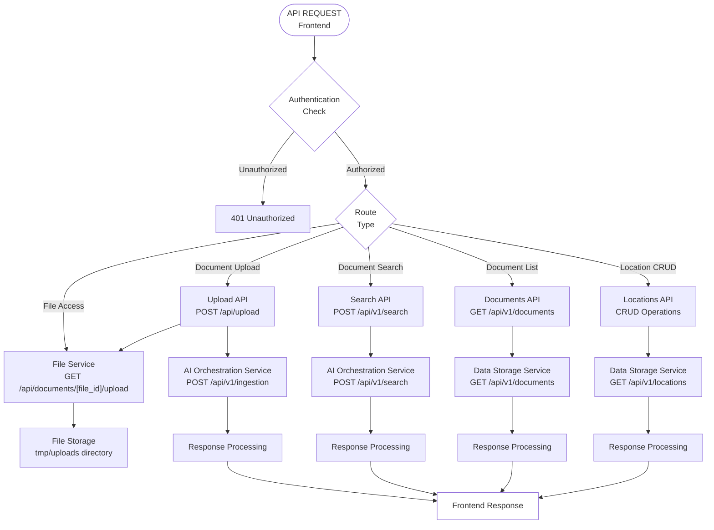
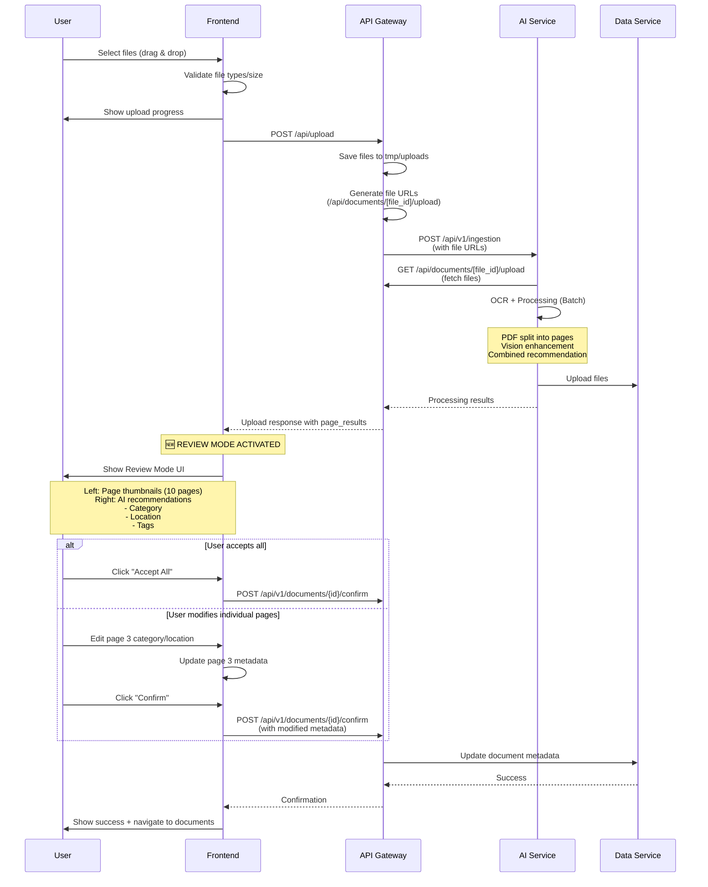
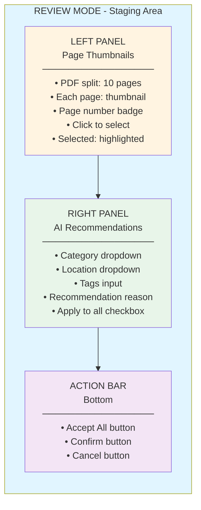
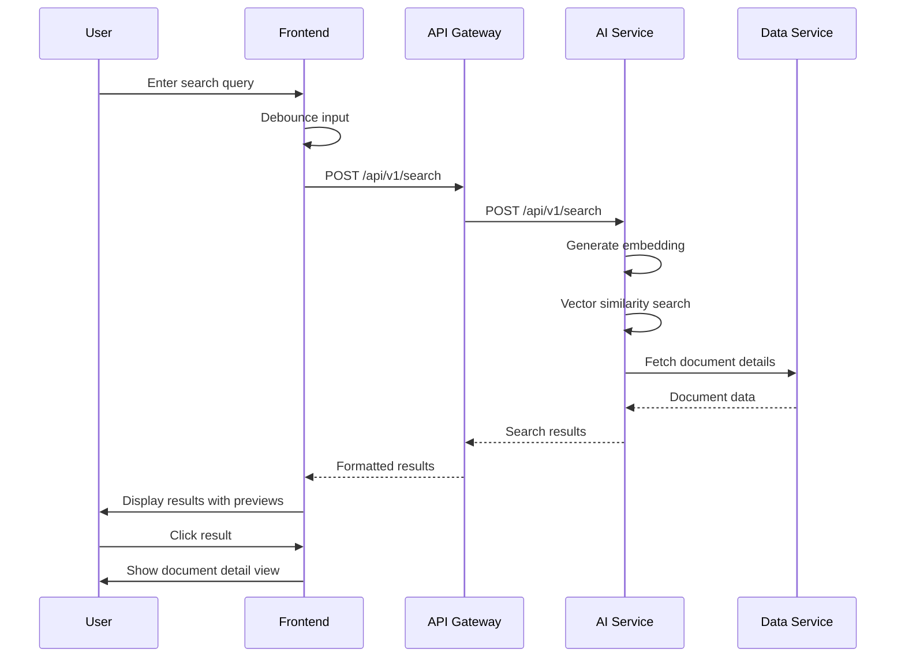

> **For Cursor AI**: This document serves as the **Master Plan and Context** for the `StorageHelperWebService`.
> Please read this before generating code to understand the architecture, current progress, and task dependencies.

## 1. Service Overview
**StorageHelperWebService** is the user-facing frontend and API gateway of the Home AI Paper Organizer. It provides the web interface and REST API endpoints that users interact with to manage their documents.

**Core Responsibilities:**
1. **Frontend Application**: Modern, responsive web UI built with React/Next.js for document management
2. **API Gateway**: RESTful API endpoints that coordinate between frontend and backend services
3. **User Authentication**: Secure user authentication and session management
4. **File Upload Interface**: Drag-and-drop and file picker UI for document/image uploads
5. **Search Interface**: Natural language search UI with real-time results
6. **Document Management**: View, edit, and organize documents with location recommendations
7. **Location Management**: Manage storage locations (cabinets, drawers, boxes) with photos

---

## 2. Architecture & Data Flow

### 2.1 Frontend Architecture

The frontend is built as a modern single-page application (SPA) or server-side rendered (SSR) application with component-based architecture.

**Technology Stack (Locked):**
- **Framework**: Next.js 14+ (App Router)
  - **Rationale**: Built-in API Routes (BFF pattern), SSR for fast initial load, easy Vercel deployment
- **UI Library**: Shadcn/ui (基于 Tailwind CSS)
  - **Rationale**: Copy-paste components (not a library), highly customizable, lightweight, excellent Cursor AI support
- **State/Data Fetching**: TanStack Query (React Query)
  - **Rationale**: Automatic caching, loading states, refetching. Perfect for read-heavy operations (Search, List). Reduces code by ~50%
- **State Management (Client)**: Zustand
  - **Rationale**: For minimal client-side state (sidebar toggle, selected files). Much simpler than Redux
- **Form Handling**: React Hook Form
- **HTTP Client**: Native Fetch API (via TanStack Query)
- **Styling**: Tailwind CSS (via Shadcn/ui)

#### Frontend Component Architecture

```mermaid
flowchart TD
    Start([WEB APPLICATION<br/>StorageHelperWebService]) --> Router[ROUTER<br/>Route Management]
    
    Router --> Auth[Auth Pages<br/>Login/Register]
    Router --> Dashboard[Dashboard<br/>Main Interface]
    Router --> Upload[Upload Page<br/>Document Upload]
    Router --> Search[Search Page<br/>Document Search]
    Router --> Documents[Documents Page<br/>Document List/View]
    Router --> Locations[Locations Page<br/>Location Management]
    
    Dashboard --> Layout[Layout Component<br/>Navigation/Sidebar]
    Upload --> Layout
    Search --> Layout
    Documents --> Layout
    Locations --> Layout
    
    Layout --> Header[Header Component<br/>User Info/Logout]
    Layout --> Sidebar[Sidebar Component<br/>Navigation Menu]
    Layout --> MainContent[Main Content Area]
    
    Upload --> FileUpload[File Upload Component<br/>Drag & Drop/File Picker]
    Upload --> UploadProgress[Upload Progress<br/>Progress Bar/Status]
    Upload --> ReviewMode[🆕 Review Mode Component<br/>Staging Area]
    ReviewMode --> PageThumbnails[Page Thumbnails Panel<br/>Left: Grid of page images]
    ReviewMode --> Recommendations[Recommendations Panel<br/>Right: AI suggestions]
    ReviewMode --> ReviewActions[Review Actions<br/>Accept All / Confirm / Cancel]
    
    Search --> SearchBar[Search Bar Component<br/>Query Input]
    Search --> SearchResults[Search Results Component<br/>Result Cards/List]
    SearchResults --> ResultCard[Result Card Component<br/>Document Preview]
    
    Documents --> DocumentList[Document List Component<br/>Table/Grid View]
    Documents --> DocumentView[Document View Component<br/>Detail View]
    Documents --> DocumentEdit[Document Edit Component<br/>Edit Form]
    
    Locations --> LocationList[Location List Component<br/>Location Cards]
    Locations --> LocationForm[Location Form Component<br/>Create/Edit Location]
    
    style Start fill:#0000
    style Router fill:#0000
    style Layout fill:#0000
```



#### Key Design Features

1. **Component-Based Architecture**: Reusable, modular React components
2. **Responsive Design**: Mobile-first approach with breakpoints for tablet and desktop
3. **State Management**: Centralized state management for user data, documents, and locations
4. **API Integration**: Service layer abstracts backend API calls
5. **Error Handling**: User-friendly error messages and loading states
6. **Accessibility**: WCAG 2.1 compliance for screen readers and keyboard navigation
7. **Performance**: Code splitting, lazy loading, and optimized bundle size

### 2.2 API Gateway Architecture

The API gateway layer handles communication between frontend and backend services.

#### API Gateway Flow



#### Key Design Features

1. **Request Validation**: Input validation and sanitization before forwarding to backend
2. **Error Handling**: Consistent error response format across all endpoints
3. **Rate Limiting**: Protect backend services from abuse
4. **CORS Configuration**: Proper CORS headers for frontend access
5. **Authentication Middleware**: JWT token validation and user context
6. **Response Transformation**: Format backend responses for frontend consumption
7. **Caching Strategy**: Cache static data (locations, categories) to reduce backend load

### 2.3 User Flow: Document Upload with Review Mode

**🆕 Enhanced Upload Flow with Batch Review**

The upload process includes a **Review Mode (Staging Area)** that allows users to review and adjust AI recommendations before final confirmation. This is especially important for batch uploads and PDF page splitting.



#### Review Mode UI Layout



**Key Features of Review Mode:**
1. **Page Thumbnail Grid**: Left panel shows all pages (especially important for multi-page PDFs split into 10+ pages)
2. **Individual Page Selection**: Click thumbnail to select and edit that specific page
3. **Bulk Actions**: "Apply to All" checkbox to apply category/location to all pages at once
4. **AI Recommendation Display**: Shows AI's reasoning for category and location suggestions
5. **Manual Override**: Users can override AI recommendations for any page
6. **Batch Confirmation**: "Accept All" button for quick approval, or "Confirm" after individual edits

### 2.4 User Flow: Document Search



---

## 3. Implementation Plan & Progress Tracking

**Current Phase:** Phase 1 (Frontend Foundation) - In Progress
**Timeline:** December 11, 2025 - Ongoing
**Last Updated:** December 11, 2025

### 3.1 Project Setup & Infrastructure
- [x] **FE-01**: Initialize Next.js 14+ Project (App Router) & Development Environment
  - [x] Create Next.js 14+ project with App Router
  - [x] Setup TypeScript configuration
  - [x] Configure Next.js build settings
  - [x] Setup ESLint and Prettier (via Next.js defaults)
  - [x] Configure environment variables (.env.example created)
  - [ ] Setup API Routes structure (for BFF pattern) - Deferred
- [x] **FE-02**: Setup UI Component Library (Shadcn/ui)
  - [x] Install and configure Shadcn/ui base components
  - [x] Setup Tailwind CSS configuration
  - [x] Install base Shadcn components (Button, Input, Card)
  - [x] Configure theme (light/dark mode support via CSS variables)
  - [ ] Create custom components extending Shadcn - In Progress
  - [x] Setup responsive breakpoints
- [x] **FE-03**: Setup Routing & Navigation
  - [x] Configure Next.js App Router
  - [x] Create route definitions (login, dashboard)
  - [ ] Implement navigation components - Pending
  - [x] Setup protected routes (AuthGuard component)
- [x] **FE-04**: Setup State Management & Data Fetching
  - [x] Setup TanStack Query (React Query)
    - [x] Configure QueryClient
    - [ ] Setup query hooks for documents, locations, search - Pending
    - [x] Configure cache settings
  - [x] Setup Zustand for client state
    - [x] Create auth store (user session management)
    - [x] Configure persistence (localStorage)
  - [x] Create API service layer (base client setup)
  - [ ] Setup error handling with React Query error boundaries - Pending

### 3.2 Authentication & User Management
- [x] **FE-05**: Implement Authentication UI
  - [x] Login page component (userid-based, no password, English UI)
  - [ ] Register page component - Not needed (users created via DataStorage API)
  - [ ] Password reset flow - Not needed (no password system)
  - [x] Form validation (userid validation)
  - [x] English language interface
- [x] **FE-06**: Implement Authentication Logic
  - [ ] JWT token management - Not needed (session-based on userid)
  - [x] Session persistence (Zustand + localStorage)
  - [x] Auth store (Zustand)
  - [x] Protected route guards (AuthGuard component)
  - [x] User validation (calls DataStorage Service GET /api/users/{user_id})
- [ ] **FE-07**: User Profile Management
  - [ ] User profile page
  - [ ] Profile edit form
  - [ ] Avatar upload
  - [ ] Settings page

### 3.3 Document Upload Interface
- [x] **FE-08**: File Upload Component
  - [x] File picker button
  - [x] File type validation (image/*, .pdf)
  - [x] File selection display
  - [x] User notes input (optional)
  - [x] Multiple file selection (supports selecting multiple files at once)
  - [x] Selected files list with remove option
  - [x] Batch upload support
  - [ ] Drag & drop area - Pending
  - [ ] File size validation - Pending
- [x] **FE-09**: Upload Progress & Status
  - [x] Loading state during upload
  - [x] Success/error notifications
  - [x] Upload mutation with TanStack Query
  - [ ] Progress bar component - Pending
  - [ ] Upload queue management - Pending
  - [ ] Retry failed uploads - Pending
- [ ] **FE-10**: Upload Review Mode (Staging Area) 🆕
  - [ ] Review Mode layout (split view: thumbnails + recommendations)
  - [ ] Page thumbnail grid component (left panel)
    - [ ] Display page thumbnails (especially for PDF splits)
    - [ ] Page number badges
    - [ ] Selection highlighting
    - [ ] Click to select individual page
  - [ ] AI recommendations panel (right panel)
    - [ ] Display category recommendation with dropdown
    - [ ] Display location recommendation with dropdown
    - [ ] Display tags suggestions
    - [ ] Show recommendation reason/explanation
    - [ ] "Apply to All" checkbox
  - [ ] Review actions bar
    - [ ] "Accept All" button (quick approval)
    - [ ] "Confirm" button (after edits)
    - [ ] "Cancel" button (discard upload)
  - [ ] Individual page editing
    - [ ] Select page → edit its category/location
    - [ ] Per-page metadata override
  - [ ] Batch confirmation API integration

### 3.4 Search Interface
- [ ] **FE-11**: Search Bar Component
  - [ ] Search input with autocomplete
  - [ ] Search button
  - [ ] Recent searches dropdown
  - [ ] Search suggestions
- [ ] **FE-12**: Search Results Display
  - [ ] Results list/grid view
  - [ ] Result card component
  - [ ] Document preview thumbnail
  - [ ] Similarity score display
  - [ ] Location information display
- [ ] **FE-13**: Search Filters & Sorting
  - [ ] Filter by category
  - [ ] Filter by location
  - [ ] Filter by date range
  - [ ] Sort options (relevance, date, etc.)
- [ ] **FE-14**: Search Result Detail View
  - [ ] Document detail modal/page
  - [ ] Full document preview
  - [ ] OCR text display
  - [ ] Edit document metadata
  - [ ] Navigate to location

### 3.5 Document Management
- [x] **FE-15**: Document List View
  - [x] Document list display (document IDs)
  - [x] Expandable document items
  - [x] Page IDs display for each document
  - [x] Loading and error states
  - [ ] Table/grid layout - Pending
  - [ ] Pagination component - Pending
  - [ ] Sorting and filtering - Pending
  - [ ] Bulk actions (delete, move, etc.) - Pending
- [ ] **FE-16**: Document Detail View
  - [ ] Document viewer component
  - [ ] Image/PDF preview
  - [ ] Metadata display
  - [ ] Edit form
  - [ ] Delete confirmation
- [ ] **FE-17**: Document Edit Interface
  - [ ] Category selection dropdown
  - [ ] Location selection dropdown
  - [ ] Tags input (multi-select)
  - [ ] Notes/description textarea
  - [ ] Save/cancel actions

### 3.6 Location Management
- [ ] **FE-18**: Location List View
  - [ ] Location cards/grid
  - [ ] Location photos display
  - [ ] Search/filter locations
  - [ ] Create new location button
- [ ] **FE-19**: Location Form Component
  - [ ] Create location form
  - [ ] Edit location form
  - [ ] Location photo upload
  - [ ] Name and description fields
  - [ ] Delete location with confirmation
- [ ] **FE-20**: Location Detail View
  - [ ] Location information display
  - [ ] Documents in location list
  - [ ] Location photo gallery
  - [ ] Edit/delete actions

### 3.7 Dashboard & Navigation
- [ ] **FE-21**: Dashboard Page
  - [ ] Statistics cards (total documents, locations, etc.)
  - [ ] Recent documents widget
  - [ ] Quick search widget
  - [ ] Recent activity feed
- [ ] **FE-22**: Navigation Components
  - [ ] Header with user menu
  - [ ] Sidebar navigation
  - [ ] Breadcrumb navigation
  - [ ] Mobile responsive menu
- [ ] **FE-23**: Layout Components
  - [ ] Main layout wrapper
  - [ ] Page container
  - [ ] Loading states
  - [ ] Error boundaries

### 3.8 API Integration Layer
- [ ] **FE-24**: API Service Setup (TanStack Query)
  - [ ] Configure TanStack Query client
  - [ ] Setup base API client (Fetch API)
  - [ ] Base URL configuration
  - [ ] Request interceptors (auth headers via TanStack Query)
  - [ ] Response interceptors (error handling)
  - [ ] Create query/mutation hooks for each endpoint
- [x] **FE-25**: API Endpoint Implementations
  - [x] Document upload API (BFF route: /api/upload)
  - [x] Get user documents API (GET /api/users/{user_id}/documents)
  - [x] Get document pages API (GET /api/documents/{document_id}/pages)
  - [ ] Document search API - Pending
  - [ ] Document CRUD APIs - Pending
  - [ ] Location CRUD APIs - Pending
  - [x] User authentication APIs (validate user)
- [ ] **FE-26**: Error Handling & Retry Logic
  - [ ] Network error handling
  - [ ] API error response handling
  - [ ] Retry logic for failed requests
  - [ ] User-friendly error messages

### 3.9 Testing & Quality Assurance
- [ ] **QA-01**: Unit Tests
  - [ ] Component unit tests (Jest/React Testing Library)
  - [ ] Utility function tests
  - [ ] API service tests
- [ ] **QA-02**: Integration Tests
  - [ ] User flow tests
  - [ ] API integration tests
  - [ ] End-to-end tests (Playwright/Cypress)
- [ ] **QA-03**: Accessibility Testing
  - [ ] Screen reader compatibility
  - [ ] Keyboard navigation testing
  - [ ] WCAG compliance audit
- [ ] **QA-04**: Performance Testing
  - [ ] Bundle size optimization
  - [ ] Load time testing
  - [ ] Lighthouse audit

### Summary
**Completion Status: 9/26 tasks completed (35%)**
- **Completed**: 
  - ✅ Project initialization (Next.js 14+, TypeScript, Tailwind)
  - ✅ Base UI components (Shadcn/ui: Button, Input, Card)
  - ✅ Authentication system (userid-based login, session management, English UI)
  - ✅ Protected routes (AuthGuard)
  - ✅ API client setup (base structure)
  - ✅ File upload component (multiple file selection, batch upload, validation, notes)
  - ✅ Document list view (document IDs and page IDs display)
  - ✅ BFF API route for file upload (/api/upload with batch support)
  - ✅ Document file service (/api/documents/{file_id}/upload)
  - ✅ API integration with AI Service (batch ingestion) and DataStorage Service (documents, pages)
- **In Progress**: 
  - 🔄 Upload progress bar
  - 🔄 Drag & drop functionality
- **Next Steps**: 
  - Review Mode for batch uploads
  - Document search interface
  - Document detail view
  - Location management

---

## 4. API Interface Contracts

### Frontend API Endpoints

The frontend will consume APIs from both the Web Service API Gateway and directly from backend services when appropriate.

#### Authentication Endpoints

**POST `/api/v1/auth/login`**
```json
Request:
{
  "email": "user@example.com",
  "password": "password123"
}

Response:
{
  "token": "jwt_token_here",
  "user": {
    "id": 1,
    "email": "user@example.com",
    "name": "User Name"
  }
}
```

**POST `/api/v1/auth/register`**
```json
Request:
{
  "email": "user@example.com",
  "password": "password123",
  "name": "User Name"
}

Response:
{
  "token": "jwt_token_here",
  "user": {
    "id": 1,
    "email": "user@example.com",
    "name": "User Name"
  }
}
```

#### Document Upload Endpoint

**POST `/api/upload`** (BFF Route)
```json
Request (multipart/form-data):
{
  "files": File[],
  "owner_id": 1,
  "user_notes": "Optional notes"
}

Response:
{
  "status": "success",
  "document_id": 6,
  "recommendation": {
    "category_id": 3,
    "location_id": 1,
    "recommendation_reason": "The document is...",
    "suggested_tags": ["tag1", "tag2"]
  },
  "total_pages": 3,
  "successful_pages": 3,
  "failed_pages": 0,
  "page_results": [...]
}
```

**Note**: This endpoint is a BFF (Backend For Frontend) route that:
- Accepts file uploads from the frontend
- Saves files temporarily to `tmp/uploads` directory
- Creates HTTP URLs using `/api/documents/{file_id}/upload` format
- Forwards file URLs to AI Service for processing
- Automatically cleans up temporary files after processing

#### Document File Service Endpoint

**GET `/api/documents/{file_id}/upload`**
```
Route: GET /api/documents/{file_id}/upload

Description:
Serves uploaded files from temporary storage for AI Service processing.

Parameters:
- file_id: string - Unique file identifier (temporary filename)

Response:
- File content with appropriate Content-Type header
- Security: Prevents path traversal attacks
- Content-Type: Auto-detected from file extension

Note: Files are served from tmp/uploads directory and cleaned up after processing.
```

#### Document Search Endpoint

**POST `/api/v1/search`**
```json
Request:
{
  "query": "Where is my W2?",
  "owner_id": 1,
  "top_k": 10
}

Response:
{
  "results": [
    {
      "document_id": "abc-123",
      "score": 0.89,
      "title": "W-2 Wage and Tax...",
      "snippet": "Full text snippet...",
      "preview_image_url": "http://...",
      "created_at": "2024-01-01T00:00:00Z",
      "location": {
        "id": 2,
        "name": "Tax Documents Drawer",
        "photo_url": "/img/drawer.jpg"
      }
    }
  ]
}
```

#### Document Management Endpoints

**GET `/api/v1/documents`**
```json
Query Parameters:
- owner_id: number
- page: number
- limit: number
- category_id: number (optional)
- location_id: number (optional)

Response:
{
  "documents": [...],
  "total": 100,
  "page": 1,
  "limit": 20
}
```

**GET `/api/v1/documents/{id}`**
```json
Response:
{
  "id": 6,
  "owner_id": 1,
  "category_id": 3,
  "location_id": 1,
  "tags": ["tag1", "tag2"],
  "created_at": "2024-01-01T00:00:00Z",
  "pages": [...]
}
```

**PUT `/api/v1/documents/{id}`**
```json
Request:
{
  "category_id": 3,
  "location_id": 1,
  "tags": ["tag1", "tag2"],
  "notes": "User notes"
}

Response:
{
  "id": 6,
  "category_id": 3,
  "location_id": 1,
  ...
}
```

#### Location Management Endpoints

**GET `/api/v1/locations`**
```json
Response:
{
  "locations": [
    {
      "id": 1,
      "name": "Tax Documents Drawer",
      "description": "Top drawer of filing cabinet",
      "photo_url": "/img/drawer.jpg",
      "created_at": "2024-01-01T00:00:00Z"
    }
  ]
}
```

**POST `/api/v1/locations`**
```json
Request:
{
  "name": "New Location",
  "description": "Description",
  "photo": File
}

Response:
{
  "id": 5,
  "name": "New Location",
  ...
}
```

---

## 5. File Structure
*(Please update this tree as we create files to keep context fresh)*

```text
StorageHelperWebService/
├── app/                         # Next.js App Router
│   ├── (dashboard)/             # Protected routes
│   │   ├── layout.tsx           # Dashboard layout (with AuthGuard)
│   │   └── dashboard/
│   │       └── page.tsx         # Dashboard page (upload + document list)
│   ├── api/                     # API Routes (BFF)
│   │   ├── upload/
│   │   │   └── route.ts         # File upload endpoint (batch support)
│   │   └── documents/
│   │       └── [file_id]/
│   │           └── upload/
│   │               └── route.ts  # Document file serving endpoint
│   ├── login/
│   │   └── page.tsx             # Login page (English UI)
│   ├── layout.tsx               # Root layout
│   ├── page.tsx                 # Home page (redirects to login)
│   └── globals.css              # Global styles
├── components/                  # React components
│   ├── ui/                      # Shadcn/ui components
│   │   ├── button.tsx
│   │   ├── input.tsx
│   │   └── card.tsx
│   ├── upload/                  # Upload components
│   │   └── FileUpload.tsx       # Multi-file upload component
│   ├── documents/               # Document components
│   │   └── DocumentList.tsx     # Document list with expandable pages
│   ├── auth-guard.tsx           # Route protection component
│   └── providers.tsx            # TanStack Query provider
├── lib/                         # Utilities and configurations
│   ├── api/                     # API client
│   │   ├── client.ts            # Base API client (Fetch)
│   │   ├── auth.ts              # Auth API (user validation)
│   │   └── documents.ts         # Documents API hooks
│   ├── store/                   # Zustand stores
│   │   └── authStore.ts         # Auth state management
│   └── utils.ts                 # Utility functions (cn helper)
├── tmp/                         # Temporary files (gitignored)
│   └── uploads/                 # Temporary upload directory
├── .env.example                 # Environment variables template
├── .gitignore
├── package.json
├── tsconfig.json
├── tailwind.config.ts           # Tailwind CSS config
├── postcss.config.js            # PostCSS config
├── next.config.js               # Next.js config
└── README.md                    # Project documentation
```

---

## 6. Development Log / Notes
*   **Project Initialization**: Planning phase - architecture and design documentation created
*   **Technology Stack Locked** (December 11, 2025):
  - **Framework**: Next.js 14+ (App Router) - chosen for BFF pattern, SSR, and easy deployment
  - **UI Library**: Shadcn/ui (Tailwind CSS) - chosen for copy-paste components, high customizability, excellent Cursor AI support
  - **Data Fetching**: TanStack Query (React Query) - chosen for automatic caching, loading states, and reduced code complexity
  - **State Management**: Zustand - chosen for minimal client-side state management (simpler than Redux)
*   **UX Enhancement: Review Mode** (December 11, 2025):
  - **Problem Identified**: Batch uploads and PDF page splitting require user review before final confirmation
  - **Solution**: Implemented Review Mode (Staging Area) with split-view layout
    - Left panel: Page thumbnails grid (especially important for multi-page PDFs)
    - Right panel: AI recommendations (category, location, tags) with manual override
    - Action bar: "Accept All" for quick approval, "Confirm" after edits, "Cancel" to discard
  - **Benefits**: 
    - Users can review AI recommendations before committing
    - Individual page editing for batch uploads
    - Better UX for "AI 智能管家" positioning
*   **Project Initialization** (December 11, 2025):
  - **Next.js 14+ Setup**: Initialized project with App Router, TypeScript, Tailwind CSS
  - **Shadcn/ui Integration**: Installed base UI components (Button, Input, Card)
  - **State Management**: Implemented Zustand for auth state with localStorage persistence
  - **Authentication System**: 
    - Userid-based login (no password required)
    - English language interface
    - User validation via DataStorage Service API (GET /api/users/{user_id})
    - Session management with Zustand store
    - Protected routes with AuthGuard component
    - Error messages in English
  - **API Client Setup**: Base API client structure for AI Service and DataStorage Service
  - **File Structure**: Created Next.js App Router structure with (dashboard) route group
*   **File Upload & Document Management** (December 11, 2025):
  - **File Upload Component**: 
    - File picker with type validation (image/*, .pdf)
    - **Multiple file selection support** (can select and upload multiple files at once)
    - Selected files list with individual remove option
    - User notes input field
    - Upload status and error handling
    - Integration with TanStack Query mutations
    - Batch upload progress display
  - **BFF API Route**: Created `/api/upload` route that:
    - Accepts multiple file uploads via FormData
    - Saves files to temporary directory (`tmp/uploads`)
    - Creates HTTP URLs for AI Service access (`/api/documents/{file_id}/upload`)
    - Forwards all file URLs to AI Service batch ingestion API
    - Automatically cleans up temporary files after processing
    - Returns batch processing results (total_pages, successful_pages, failed_pages)
  - **Document File Service**: Created `/api/documents/{file_id}/upload` endpoint:
    - Serves files from `tmp/uploads` directory
    - Route format: `GET /api/documents/{file_id}/upload`
    - Security: Prevents path traversal attacks
    - Content-Type detection based on file extension
  - **Document List Component**:
    - Displays all document IDs for logged-in user
    - Expandable items to show page IDs for each document
    - Fetches pages on-demand when expanded
    - Uses TanStack Query for data fetching and caching
  - **API Integration**:
    - `getUserDocuments()`: Calls DataStorage Service GET /api/users/{user_id}/documents
    - `getDocumentPages()`: Calls DataStorage Service GET /api/documents/{document_id}/pages
    - File upload: BFF route → AI Service POST /api/v1/ingestion (batch processing support)
  - **Dashboard Layout**: Updated to show upload form and document list side by side
*   **UI Language Standardization** (December 11, 2025):
  - **Login Page**: Converted all Chinese text to English
    - "登录" → "Login"
    - "用户ID" → "User ID"
    - "请输入用户ID" → "Enter user ID"
    - "请输入有效的用户ID（正整数）" → "Please enter a valid user ID (positive integer)"
    - "登录失败，请重试" → "Login failed, please try again"
    - "登录中..." → "Logging in..."
  - **Authentication API**: Error messages converted to English
    - "用户不存在" → "User not found"
    - "验证用户时发生未知错误" → "Unknown error occurred while validating user"
  - **Code Comments**: All comments in English for consistency
  - **Rationale**: English interface provides better consistency for development and internationalization readiness

---

### **Instructions for Cursor**
1.  **Check the Task List**: Before starting a task, verify dependencies.
2.  **Follow the Architecture**: Keep components modular and reusable. Use the service layer for API calls.
3.  **Update this File**: When a feature is completed, mark the checkbox `[x]` and update the File Structure if new files were added.
4.  **UI/UX Best Practices**: Follow modern web design principles - responsive, accessible, and performant.
5.  **API Integration**: Always use the service layer for API calls, never call APIs directly from components.

